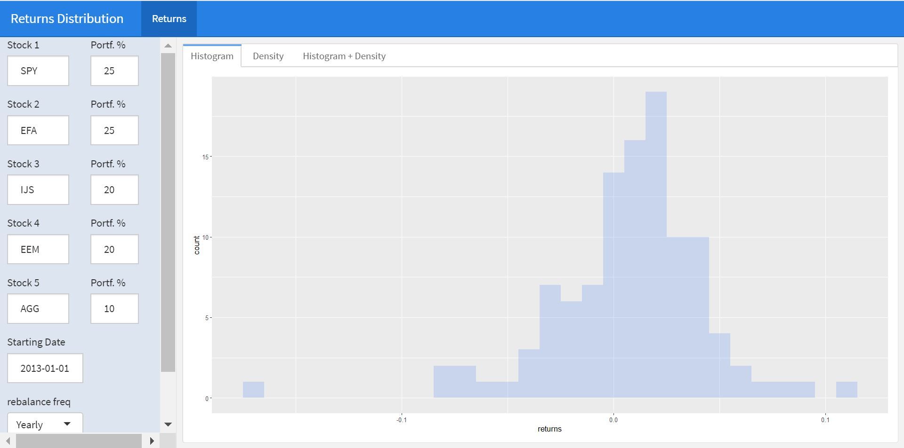

```{r setup, include = FALSE}
library(knitr)                              # paquete que trae funciones utiles para R Markdown
library(tidyverse)                          # paquete que trae varios paquetes comunes en el tidyverse
library(datos)                              # paquete que viene con datos populares traducidos al español :)
library(shiny)
library(icons)
# opciones predeterminadas
knitr::opts_chunk$set(echo = FALSE,         # FALSE: los bloques de código NO se muestran
                      dpi = 300,            # asegura gráficos de alta resolución
                      warning = FALSE,      # los mensajes de advertencia NO se muestran
                      error = FALSE)        # los mensajes de error NO se muestran


options(htmltools.dir.version = FALSE)


library(tidyverse)
library(lubridate)
library(readxl)
library(highcharter)
library(tidyquant)
library(timetk)
library(tibbletime)
library(quantmod)
library(PerformanceAnalytics)
library(scales)


```

class: left, bottom
background-image: url("img/back1.jpg")
background-size: cover


# **`r rmarkdown::metadata$title`**
----

## **`r rmarkdown::metadata$institute`**

### `r rmarkdown::metadata$author`
### `r rmarkdown::metadata$date`

```{r xaringanExtra-share-again, echo=FALSE}
xaringanExtra::use_share_again()
```

```{r xaringanExtra-clipboard, echo=FALSE}
xaringanExtra::use_clipboard()
```

---
name: hola
class: inverse, middle, center
background-color: #E31D1D


# Universidad del Valle

--

## Maestría en Análitica e Inteligencia de Negocios
---


<br><br>

.center[


[PhD.(C) Orlando Joaqui-Barandica](https://www.joaquibarandica.com) <br/>
Universidad del Valle
]

<br>


.center[

*PhD.(C) Ingeniería con enfásis en Ingeniería Industrial* 
 
*MSc. Economía Aplicada*
 
*Estadístico*

<br>

`r icon::fa("link", animate = "spin")` [www.joaquibarandica.com](https://www.joaquibarandica.com)

]


---

class: center, middle


### [https://gifinc.univalle.edu.co/](https://gifinc.univalle.edu.co/)


---

name: menu
background-image: url("img/back2.jpg")
background-size: cover
class: left, middle


# Contenido

----


.pull-left[
### `r icon("upload")` [Cálculo de retornos](#retornos)
* xts
* tidyverse
* tidyquant


### `r icon("broom")` [Visualización](#Vis)
* xts
* tidyverse


]


.pull-right[

### `r icon("cubes")` [Construcción de portafolio](#portafolio)
* xts
* tidyverse
* tidyquant


###  `r icon("cubes")` [Shiny App](#shiny)

]

---

name: retornos
class: inverse, center, middle
background-color: #00081d

# `r icon("upload")`
# Cálculo de retornos
----

.right[
.bottom[
####  [`r icon("bell")`](#menu)
]
]

---

# `r icon("upload")` Packages


Los siguientes son los paquetes que serán utilizados en los temas del curso.


----

.scroll-box-20[
```{r eval=FALSE, echo=TRUE, message=FALSE, warning=FALSE , fig.height = 4}


# tidyverse contains the packages tidyr, ggplot2, dplyr,
# readr, purrr and tibble
install.packages("tidyverse")
install.packages("lubridate")
install.packages("readxl")
install.packages("highcharter")
install.packages("tidyquant")
install.packages("timetk")
install.packages("tibbletime")
install.packages("quantmod")
install.packages("PerformanceAnalytics")
install.packages("scales")


library(tidyverse)
library(lubridate)
library(readxl)
library(highcharter)
library(tidyquant)
library(timetk)
library(tibbletime)
library(quantmod)
library(PerformanceAnalytics)
library(scales)

```
]

----


---

# `r icon("upload")` Asset Prices to Returns


En nuestro tema de rendimientos de activos `(asset returns)` tomaremos datos de precios sin procesar para 5 activos individuales y los transformaremos en rendimientos mensuales para una sola cartera `(portfolio)`. 


.pull-left[

Nuestro portafolio consiste en los siguientes ETFs (Exchange Traded Funds)

- SPY (S&P500 ETF) `weighted 25%`
- EFA (a non-US equities ETF) `weighted 25%`
- IJS (a small-cap value ETF) `weighted 20%`
- EEM (an emerging-markets ETF) `weighted 20%`
- AGG (a bond ETF) `weighted 10%`


### Enfoques

Trabajaremos tres enfoques de codificación:

* xts
* tidyverse
* tidyquant


]


.pull-right[

<br>


]


---


# `r icon("upload")` Asset Prices to Returns


### Cargar los precios diarios

.pull-left[

Lo hacemos con los `symbols <- c("SPY", "EFA", "IJS", "EEM", "AGG")`. Esos son los tickers de los 5 activos de nuestra cartera. Si desea cambiar a diferentes activos para realizar pruebas, cambie esos tickers. Tenga en cuenta que si desea elegir diferentes tickers de acciones o crear una cartera diferente, cambie los tickers en el vector de símbolos.

----

```{r eval=FALSE, echo=TRUE, message=FALSE, warning=FALSE , fig.height = 4}

symbols <- c("SPY","EFA", "IJS", "EEM","AGG")

```

----

Importaremos los 5 ETFs en un objeto `xts` llamado precios.


]


.pull-right[

La función `getSymbols()` del paquete `quantmod` nos permite realizar lectura de los datos diarios desde [Yahoo! Finance](https://finance.yahoo.com/).


<br>

Esto devolverá un objeto con el precio de apertura, precio de cierre, precio ajustado, máximo diario, mínimo diario y volumen diario para cada ticker.


]


---


# `r icon("upload")` Asset Prices to Returns


### Cargar los precios diarios

.pull-left[


<br>

----

```{r eval=FALSE, echo=TRUE, message=FALSE, warning=FALSE , fig.height = 4}

prices <-
getSymbols(symbols,
           src = 'yahoo',
           from = "2012-12-31",
           to = "2017-12-31",
           auto.assign = TRUE,
           warnings = FALSE) %>%
map(~Ad(get(.)))

```

----

Note que la fuente se especifica desde Yahoo! Finance con `src = 'yahoo'`.

]


.pull-right[


* Estamos imponiendo una fecha de inicio de "2012-12-31" y una fecha de finalización de "2017-12-31". Eso significa que trabajaremos con 5 años de datos (cuando convertimos a rendimientos mensuales, perderemos diciembre de 2012)


<br>


* Para aislar el precio ajustado, usamos la función `map()` del paquete `purrr` y aplicamos `Ad(get(.))` a los precios. Esto obtendrá el precio ajustado de cada una de nuestras series individuales. Si quisieramos el precio de cierre sería: `Cl(get(.))`.
Aquí, el `.` hace referencia a nuestro objeto inicial.

]


---


# `r icon("upload")` Asset Prices to Returns


### Cargar los precios diarios

.pull-left[


<br>

----

```{r eval=FALSE, echo=TRUE, message=FALSE, warning=FALSE , fig.height = 4}

prices <-
getSymbols(symbols,
           src = 'yahoo',
           from = "2012-12-31",
           to = "2017-12-31",
           auto.assign = TRUE,
           warnings = FALSE) %>%
map(~Ad(get(.))) %>%
reduce(merge) %>%
`colnames<-`(symbols)

```

----

]


.pull-right[

<br>

* `map()` devuelve una lista de 5 objetos `xts`.


* `reduce(merge)` fusionará las 5 listas en un solo objeto `xts`.

* `merge()` busca el índice de fecha compartido por nuestros objetos y usa ese índice para alinear los datos.

* `colnames <-` renombra las columnas de acuerdo  al objeto `symbols`

]


---


# `r icon("upload")` Asset Prices to Returns


### Cargar los precios diarios desde un external file

.pull-left[


----

```{r eval=FALSE, echo=TRUE, message=FALSE, warning=FALSE , fig.height = 4}

# Desde .csv
prices <-
      read_csv("path to your data.csv",
          col_types =
          cols(date =
          col_date(format = "%Y-%m-%d"))) %>%
tk_xts(date_var = date)


# Desde .xlsx
prices <-
       read_excel("path to your excel spreadsheet",
                 col_types = c("text", "numeric",
                 "numeric", "numeric",
                 "numeric", "numeric")) %>%
mutate(date = ymd(date)) %>%
tk_xts(date_var = date)


```

----

]


.pull-right[


* Para cargar el archivo usamos la función `read_csv()`  del paquete `readr`. Si la extensión es *.csv*, si hay otras extensiones como *.xlsx* se puede utilizar la función `read_xlsx()` o `read_excel` del paquete `readxl`.


* `tk_xts(date_var = date)` convierte el data frame en `xts`.

* `ymd()` del paquete `lubridate` convierte a formato fecha el vector.

* `mutate()` crea una variable.

]


---


# `r icon("upload")` Asset Prices to Returns


### Al final tenemos...

.pull-left[


----

```{r eval=FALSE, echo=TRUE, message=FALSE, warning=FALSE , fig.height = 4}

symbols <- c("SPY","EFA", "IJS", "EEM","AGG")


prices <-
getSymbols(symbols,
           src = 'yahoo',
           from = "2012-12-31",
           to = "2017-12-31",
           auto.assign = TRUE,
           warnings = FALSE) %>%
map(~Ad(get(.))) %>%
reduce(merge) %>%
`colnames<-`(symbols)

head(prices,10)


```

----

]


.pull-right[


```{r eval=TRUE, echo=FALSE, message=FALSE, warning=FALSE , fig.height = 4}

symbols <- c("SPY","EFA", "IJS", "EEM","AGG")


prices <-
getSymbols(symbols,
           src = 'yahoo',
           from = "2012-12-31",
           to = "2017-12-31",
           auto.assign = TRUE,
           warnings = FALSE) %>%
map(~Ad(get(.))) %>%
reduce(merge) %>%
`colnames<-`(symbols)

head(prices,10)


```


]


---


# `r icon("upload")` `xts`


.pull-left[

La primera observación en nuestro objeto de precios es el 31 de diciembre de 2012 (último día de negociación de ese año) y tenemos precios diarios. Queremos convertir esos precios diarios en retornos de registros mensuales basados en la última lectura de cada mes.

<br>

----

* Usaremos `to.monthly(prices, indexAt = "lastog", OHLC = FALSE)` del paquete `quantmod`.

<br>

* El argumento `indexAt = "lastof"` le dice a la función si queremos indexar al primer día del mes o al último día. Si quisieramos usar el primer día, lo cambiariamos a `indexAt = "firstof"`.

----


]


.pull-right[


<br><br>

----


```{r eval=TRUE, echo=TRUE, message=FALSE, warning=FALSE , fig.height = 4}

prices_monthly <- to.monthly(prices,
                  indexAt = "lastof",
                  OHLC = FALSE)

head(prices_monthly, 7)


```


----


* Hemos convertido un objeto `xts` diario a un objeto `xts` mensual

]


---


# `r icon("upload")` `xts`


.pull-left[


* Usaremos `Return.calculate(prices_monthly, method = "log")` para convertir a retornos y guardar un objeto llamado `asset_returns_xts`


* Note que estos están dados en logaritmo por `method = "log"`.

$$r_t = ln \left( \frac{P_t}{P_{t-1}} \right)$$

* Podríamos usar `method = "discrete"` para obtener los retornos simples.

$$r_t = \frac{P_t - P_{t-1}}{P_{t-1}}$$

* Podríamos usar `method = "difference"` para obtener diferencias.


$$r_t = P_t - P_{t-1}$$

]


.pull-right[


<br><br>

----


```{r eval=TRUE, echo=TRUE, message=FALSE, warning=FALSE , fig.height = 4}

asset_returns_xts <-
                     Return.calculate(prices_monthly,
                     method = "log") %>%
na.omit()

head(round(asset_returns_xts,3), 7)


```


----


]


---

class: inverse, center, middle
background-color: #00081d


# xts


.pull-left[

En términos más generales, este es un buen momento para notar cómo nuestras decisiones en la transformación de datos pueden afectar los datos que finalmente sobreviven a nuestra etapa analítica. 

Acabamos de perder el primer mes de precios diarios. 

Quizás eso no nos importe, o quizás queremos cambiar la fecha de inicio original para asegurarnos de capturar diciembre de 2012. Depende de la tarea y los datos, y si subcontratamos la preparación de los datos, estas decisiones se tomarán antes.

]


.pull-right[


<br><br>

----

**Desde una perspectiva sustantiva, ahora hemos importado precios diarios, recortados a precios ajustados, movidos a precios mensuales y transformados a retornos de registros mensuales, todo en el mundo xts.**

----

]


---


# `r icon("upload")` `tidyverse`


.pull-left[

Hay varias diferencias entre un objeto `xts` y un `tibble`, pero uno muy importante es la fecha, un componente esencial de la mayoría de los análisis financieros. Los objetos `xts` tienen un índice de fecha. Por el contrario, los `dataframe` tienen una columna de fecha y esa columna no es necesaria para la existencia del marco de datos.


----


```{r eval=FALSE, echo=TRUE, message=FALSE, warning=FALSE , fig.height = 4}

asset_returns_dplyr_byhand <- prices %>%
    to.monthly(indexAt = "lastof", OHLC = FALSE) %>%
    # convert the index to a date
    data.frame(date = index(.)) %>%
    # now remove the index because it got converted to row names
    remove_rownames() %>%
    gather(asset, prices, -date) %>%
    group_by(asset) %>%
    mutate(returns = (log(prices) - log(lag(prices)))) %>%
    select(-prices) %>%
    spread(asset, returns) %>%
    select(date, symbols)


```

----


]


.pull-right[


----


Nuestra conversión de xts a tibble comienza con `data.frame(date = index (.))`

* Convierte nuestro objeto en un data.frame 

* Agrega una columna de fecha basada en el índice con `date = index (.)`. 

<br>

* El índice de fecha del objeto `xts` se conserva como nombres de fila y debe eliminarse explícitamente con `remove_rownames()`.

<br>

* gather() convierte de formato wide a formato long

----


]


---


# `r icon("upload")` `tidyverse`


.pull-left[


----


```{r eval=FALSE, echo=TRUE, message=FALSE, warning=FALSE , fig.height = 4}

asset_returns_dplyr_byhand <- prices %>%
    to.monthly(indexAt = "lastof", OHLC = FALSE) %>%
    # convert the index to a date
    data.frame(date = index(.)) %>%
    # now remove the index because it got converted to row names
    remove_rownames() %>%
    gather(asset, prices, -date) %>%
    group_by(asset) %>%
    mutate(returns = (log(prices) - log(lag(prices)))) %>%
    select(-prices) %>%
    spread(asset, returns) %>%
    select(date, symbols)


```

----


]


.pull-right[


----


* `mutate()` nos permite crear nuestro propio cálculo de retornos: `mutate(returns = (log(prices) - log(lag(prices))))`

<br>

* Removemos la serie de precios ya que no la necesitamos `select(-prices)`

<br>

* `spread()` convierte de formato long a formato wide

<br>

* reordenamos las columnas según las importamos usando el objeto `symbols`, es decir,
`select(date, symbols)`


----


]


---


# `r icon("upload")` `tidyverse`


.pull-left[


----


```{r eval=FALSE, echo=TRUE, message=FALSE, warning=FALSE , fig.height = 4}

asset_returns_dplyr_byhand <- prices %>%
    to.monthly(indexAt = "lastof", OHLC = FALSE) %>%
    # convert the index to a date
    data.frame(date = index(.)) %>%
    # now remove the index because it got converted to row names
    remove_rownames() %>%
    gather(asset, prices, -date) %>%
    group_by(asset) %>%
    mutate(returns = (log(prices) - log(lag(prices)))) %>%
    select(-prices) %>%
    spread(asset, returns) %>%
    select(date, symbols)


head(asset_returns_dplyr_byhand, 10)


asset_returns_dplyr_byhand <-
asset_returns_dplyr_byhand %>%
na.omit()

```

----


]


.pull-right[


```{r eval=TRUE, echo=FALSE, message=FALSE, warning=FALSE , fig.height = 4}

asset_returns_dplyr_byhand <- prices %>%
    to.monthly(indexAt = "lastof", OHLC = FALSE) %>%
    # convert the index to a date
    data.frame(date = index(.)) %>%
    # now remove the index because it got converted to row names
    remove_rownames() %>%
    gather(asset, prices, -date) %>%
    group_by(asset) %>%
    mutate(returns = (log(prices) - log(lag(prices)))) %>%
    select(-prices) %>%
    spread(asset, returns) %>%
    select(date, symbols)


head(asset_returns_dplyr_byhand, 10)

```


]


---


# `r icon("upload")` `tidyquant`


.pull-left[


Exploremos el paradigma tidyquant para convertir a retornos logarítmicos.

----


```{r eval=FALSE, echo=TRUE, message=FALSE, warning=FALSE , fig.height = 4}

asset_returns_tq_builtin <-
           prices %>%
           tk_tbl(preserve_index = TRUE,
           rename_index = "date") %>%
           gather(asset, prices, -date) %>%
           group_by(asset) %>%
           tq_transmute(mutate_fun = periodReturn,
           period = "monthly",
           type = "log") %>%
           spread(asset, monthly.returns) %>%
           select(date, symbols) %>%
           slice(-1)

head(asset_returns_tq_builtin, 10)


```

----


]


.pull-right[


----


`tk_tbl(preserve_index = TRUE, rename_index = "date")` convierte los precios de `xts` a `tibble`

* Convierte el índice de fecha en una columna de fecha y lo renombra como "date".

* Dado que el índice se está convirtiendo, no es necesario eliminarlo como hicimos anteriormente.


<br>

* `tq_transmute(mutate_fun = periodReturn, period ="monthly", type = "log")` nos permite pasar de precios diarios a los retornos logarítmicos mensuales.


----


]


---


# `r icon("upload")` `tidyquant`


.pull-left[


Exploremos el paradigma tidyquant para convertir a retornos logarítmicos.

----


```{r eval=FALSE, echo=TRUE, message=FALSE, warning=FALSE , fig.height = 4}

asset_returns_tq_builtin <-
           prices %>%
           tk_tbl(preserve_index = TRUE,
           rename_index = "date") %>%
           gather(asset, prices, -date) %>%
           group_by(asset) %>%
           tq_transmute(mutate_fun = periodReturn,
           period = "monthly",
           type = "log") %>%
           spread(asset, monthly.returns) %>%
           select(date, symbols) %>%
           slice(-1)

head(asset_returns_tq_builtin, 10)


```

----


]


.pull-right[


----


```{r eval=TRUE, echo=FALSE, message=FALSE, warning=FALSE , fig.height = 4}

asset_returns_tq_builtin <-
           prices %>%
           tk_tbl(preserve_index = TRUE,
           rename_index = "date") %>%
           gather(asset, prices, -date) %>%
           group_by(asset) %>%
           tq_transmute(mutate_fun = periodReturn,
           period = "monthly",
           type = "log") %>%
           spread(asset, monthly.returns) %>%
           select(date, symbols) %>%
           slice(-1)

head(asset_returns_tq_builtin, 10)


```


----


]


---


# `r icon("upload")` En resumen...


```{r eval=TRUE, echo=TRUE, message=FALSE, warning=FALSE , fig.height = 4}

head(asset_returns_xts, 3)

head(asset_returns_dplyr_byhand, 3)

head(asset_returns_tq_builtin, 3)

```


---


name: Vis
class: inverse, center, middle
background-color: #00081d

# `r icon("broom")`
# Visualización
----

.right[
.bottom[
####  [`r icon("bell")`](#menu)
]
]

---

# `r icon("broom")` Visualizing Asset Returns `xts`


.pull-left[

<br>

.center[


]
]

.pull-right[


> Es una buena práctica graficar los rendimientos individuales porque una vez que se construye una cartera, es poco probable que retrocedamos para visualizar de forma individual. 

> Sin embargo, esos rendimientos individuales son los componentes básicos y la materia prima de nuestra cartera y visualizarlos es una excelente manera de comprenderlos en profundidad.


<br>

.center[
### También presenta una oportunidad para buscar valores atípicos, errores o cualquier cosa inusual para corregir antes de avanzar demasiado en nuestro análisis.
]

]

---


# `r icon("broom")` Visualizing Asset Returns `xts`


.pull-left[

.center[
`Highcharter` es un paquete de R, pero Highcharts es una biblioteca de JavaScript. El paquete R es un enlace a la biblioteca de JavaScript. 


Highcharts es fantástico para visualizar series de tiempo y viene con excelentes widgets incorporados para ver diferentes marcos de tiempo, además de que podemos usar el poder de JavaScript sin salir del mundo del código R.

]

.center[
### Las visualizaciones no solo son agradables, sino que highcharter “simplemente funciona” con objetos xts en el sentido de que lee el índice como fechas sin necesidad de que se le indique.
]


]

.pull-right[


```{r eval =TRUE, echo=FALSE, message=FALSE, warning=FALSE , fig.height = 1.5 , fig.width=1.5 }

highchart(type = "stock") %>%
hc_title(text = "Monthly Log Returns") %>%
hc_add_series(asset_returns_xts[, symbols[1]],
name = symbols[1]) %>%
hc_add_series(asset_returns_xts[, symbols[2]],
name = symbols[2]) %>%
hc_add_series(asset_returns_xts[, symbols[3]],
name = symbols[3]) %>%
hc_add_series(asset_returns_xts[, symbols[4]],
name = symbols[4]) %>%
hc_add_series(asset_returns_xts[, symbols[5]],
name = symbols[5]) %>%
hc_add_theme(hc_theme_flat()) %>%
hc_navigator(enabled = FALSE) %>%
hc_scrollbar(enabled = FALSE) %>%
hc_exporting(enabled = TRUE) %>%
hc_legend(enabled = TRUE)
  

```


]

---


# `r icon("broom")` Visualizing Asset Returns `xts`


.pull-left[


* Configuramos `highchart(type = "stock")` para obtener un formato de línea agradable que fue creado específicamente para acciones.

* Luego agregamos cada una de nuestras series al flujo de código.


----
.scroll-box-14[
```{r eval =FALSE, echo=TRUE, message=FALSE, warning=FALSE , fig.height = 6 }

highchart(type = "stock") %>%
hc_title(text = "Monthly Log Returns") %>%
hc_add_series(asset_returns_xts[, symbols[1]],
name = symbols[1]) %>%
hc_add_series(asset_returns_xts[, symbols[2]],
name = symbols[2]) %>%
hc_add_series(asset_returns_xts[, symbols[3]],
name = symbols[3]) %>%
hc_add_series(asset_returns_xts[, symbols[4]],
name = symbols[4]) %>%
hc_add_series(asset_returns_xts[, symbols[5]],
name = symbols[5]) %>%
hc_add_theme(hc_theme_flat()) %>%
hc_navigator(enabled = FALSE) %>%
hc_scrollbar(enabled = FALSE) %>%
hc_exporting(enabled = TRUE) %>%
hc_legend(enabled = TRUE)
  
```
]
----

]

.pull-right[


```{r eval =TRUE, echo=FALSE, message=FALSE, warning=FALSE , fig.height = 1.5,fig.width=1.5 }

highchart(type = "stock") %>%
hc_title(text = "Monthly Log Returns") %>%
hc_add_series(asset_returns_xts[, symbols[1]],
name = symbols[1]) %>%
hc_add_series(asset_returns_xts[, symbols[2]],
name = symbols[2]) %>%
hc_add_series(asset_returns_xts[, symbols[3]],
name = symbols[3]) %>%
hc_add_series(asset_returns_xts[, symbols[4]],
name = symbols[4]) %>%
hc_add_series(asset_returns_xts[, symbols[5]],
name = symbols[5]) %>%
hc_add_theme(hc_theme_flat()) %>%
hc_navigator(enabled = FALSE) %>%
hc_scrollbar(enabled = FALSE) %>%
hc_exporting(enabled = TRUE) %>%
hc_legend(enabled = TRUE)
  

```


]

---


# `r icon("broom")` Visualizing Asset Returns `xts`


.pull-left[

<br>

### `Highcharter` también tiene la capacidad de hacer histogramas. Un método es llamar primero a la función base `hist` en los datos junto con los argumentos para los breaks y `plot = FALSE`.


]

.pull-right[

----

```{r eval =FALSE, echo=TRUE, message=FALSE, warning=FALSE , fig.height = 6 }

library(highcharter)

hc_hist <- hist(asset_returns_xts[, symbols[1]],breaks = 50,plot = FALSE)


hchart(hc_hist, color = "cornflowerblue") %>%
hc_title(text = paste(symbols[1], "Log Returns Distribution",
         sep = " ")) %>%
         hc_add_theme(hc_theme_flat()) %>%
         hc_exporting(enabled = TRUE) %>%
         hc_legend(enabled = FALSE)  

```

----

]

---

# `r icon("broom")` Visualizing Asset Returns `xts`


```{r echo=FALSE, message=FALSE, warning=FALSE,  fig.height = 1.5, fig.width=3, fig.align='center'}

library(highcharter)

hc_hist <- hist(asset_returns_xts[, symbols[1]],breaks = 50,plot = FALSE)


hchart(hc_hist, color = "cornflowerblue") %>%
hc_title(text = paste(symbols[1], "Log Returns Distribution",
         sep = " ")) %>%
         hc_add_theme(hc_theme_flat()) %>%
         hc_exporting(enabled = TRUE) %>%
         hc_legend(enabled = FALSE) 

```

---


# `r icon("broom")` Visualizing Asset Returns `xts`

```{r echo=TRUE, message=FALSE, warning=FALSE,  fig.height = 3 }

autoplot(asset_returns_xts,facets = TRUE)

```


---

# `r icon("broom")` Visualizing Asset Returns `tidyverse`


.pull-left[


> `tidyverse` pide que estos datos estén en formato long o ordenado donde cada variable tiene su propia columna. Para que los retornos de activos estén ordenadas, necesitamos una columna llamada "date", una columna llamada "stock" y una columna llamada "returns".

<br>

* Este formato es más difícil de leer para un humano: solo podemos ver las primeras lecturas de un activo. Desde una perspectiva tidyverse, esto se considera "ordenado" y es el formato preferido.

<br>

* `ggplot2` es un paquete de visualización flexible y muy utilizado, y es parte del tidyverse.

]

.pull-right[

----

```{r eval =TRUE, echo=TRUE, message=FALSE, warning=FALSE , fig.height = 6 }

asset_returns_long <-
       asset_returns_dplyr_byhand %>%
       gather(asset, returns, -date) %>%
       group_by(asset)


head(asset_returns_long, 10)

```

----

]


---


# `r icon("broom")` Visualizing Asset Returns `tidyverse`


.pull-left[

----
```{r eval =FALSE, echo=TRUE, message=FALSE, warning=FALSE , fig.height = 6 }

asset_returns_long %>%
ggplot(aes(x = returns, fill = asset)) +
geom_histogram(alpha = 0.45, binwidth = .005) +
ggtitle("Monthly Returns Since 2013")

```
----

Recuerde que puede tener dinámica el gráfico con `ggplotly` del paquete `plotly`


----
```{r eval =FALSE, echo=TRUE, message=FALSE, warning=FALSE , fig.height = 6 }

library(plotly)

g1<-asset_returns_long %>%
ggplot(aes(x = returns, fill = asset)) +
geom_histogram(alpha = 0.45, binwidth = .005) +
ggtitle("Monthly Returns Since 2013")


ggplotly(g1)


```
----

]

.pull-right[


```{r eval =TRUE, echo=FALSE, message=FALSE, warning=FALSE , fig.height = 6 }

asset_returns_long %>%
ggplot(aes(x = returns, fill = asset)) +
geom_histogram(alpha = 0.45, binwidth = .005) +
ggtitle("Monthly Returns Since 2013")

```


]


---


# `r icon("broom")` Visualizing Asset Returns `tidyverse`

```{r echo=FALSE, message=FALSE, warning=FALSE, out.height= "70%", out.width="100%"  }

library(plotly)

g1<-asset_returns_long %>%
ggplot(aes(x = returns, fill = asset)) +
geom_histogram(alpha = 0.45, binwidth = .005) +
ggtitle("Monthly Returns Since 2013")


ggplotly(g1)


```


---


# `r icon("broom")` Visualizing Asset Returns `tidyverse`


.pull-left[

----
```{r eval =FALSE, echo=TRUE, message=FALSE, warning=FALSE , fig.height = 6 }

asset_returns_long %>%
ggplot(aes(x = returns, fill = asset)) +
geom_histogram(alpha = 0.45, binwidth = .01) +
facet_wrap(~asset) +
ggtitle("Monthly Returns Since 2013") +
theme_update(plot.title = element_text(hjust = 0.5))

```
----


]

.pull-right[


```{r eval =TRUE, echo=FALSE, message=FALSE, warning=FALSE , fig.height = 6 }

asset_returns_long %>%
ggplot(aes(x = returns, fill = asset)) +
geom_histogram(alpha = 0.45, binwidth = .01) +
facet_wrap(~asset) +
ggtitle("Monthly Returns Since 2013") +
theme_update(plot.title = element_text(hjust = 0.5))

```


]


---


# `r icon("broom")` Visualizing Asset Returns `tidyverse`


.pull-left[

----
```{r eval =FALSE, echo=TRUE, message=FALSE, warning=FALSE , fig.height = 6 }

asset_returns_long %>%
ggplot(aes(x = returns, colour = asset)) +
geom_density(alpha = 1) +
ggtitle("Monthly Returns Density Since 2013") +
xlab("monthly returns") +
ylab("distribution") +
theme_update(plot.title = element_text(hjust = 0.5))

```
----


]

.pull-right[


```{r eval =TRUE, echo=FALSE, message=FALSE, warning=FALSE , fig.height = 6 }

asset_returns_long %>%
ggplot(aes(x = returns, colour = asset)) +
geom_density(alpha = 1) +
ggtitle("Monthly Returns Density Since 2013") +
xlab("monthly returns") +
ylab("distribution") +
theme_update(plot.title = element_text(hjust = 0.5))

```


]


---


# `r icon("broom")` Visualizing Asset Returns `tidyverse`


.pull-left[

----
```{r eval =FALSE, echo=TRUE, message=FALSE, warning=FALSE , fig.height = 6 }

asset_returns_long %>%
ggplot(aes(x = returns)) +
geom_density(aes(color = asset), alpha = 1) +
geom_histogram(aes(fill = asset), alpha = 0.45, binwidth = .01) +
guides(fill = FALSE) +
facet_wrap(~asset) +
ggtitle("Monthly Returns Since 2013") +
xlab("monthly returns") +
ylab("distribution") +
theme_update(plot.title = element_text(hjust = 0.5))

```
----


]

.pull-right[


```{r eval =TRUE, echo=FALSE, message=FALSE, warning=FALSE , fig.height = 6 }

asset_returns_long %>%
ggplot(aes(x = returns)) +
geom_density(aes(color = asset), alpha = 1) +
geom_histogram(aes(fill = asset), alpha = 0.45, binwidth = .01) +
guides(fill = FALSE) +
facet_wrap(~asset) +
ggtitle("Monthly Returns Since 2013") +
xlab("monthly returns") +
ylab("distribution") +
theme_update(plot.title = element_text(hjust = 0.5))

```


]


---


# `r icon("broom")` Visualizing Asset Returns `tidyverse`


.pull-left[

----
```{r eval =FALSE, echo=TRUE, message=FALSE, warning=FALSE , fig.height = 6 }

asset_returns_long %>%
  ggplot(aes(x = date, y = returns, color=asset)) +
  geom_line()+
  ggtitle("Monthly Returns Since 2013") +
  xlab("Date") +
  ylab("Returns") +
  theme_update(plot.title = element_text(hjust = 0.5))

```
----


]

.pull-right[


```{r eval =TRUE, echo=FALSE, message=FALSE, warning=FALSE , fig.height = 6 }

asset_returns_long %>%
  ggplot(aes(x = date, y = returns, color=asset)) +
  geom_line()+
  ggtitle("Monthly Returns Since 2013") +
  xlab("Date") +
  ylab("Returns") +
  theme_update(plot.title = element_text(hjust = 0.5))

```


]


---


name: portafolio
class: inverse, center, middle
background-color: #00081d

# `r icon("broom")`
# Construcción de portafolio
----

.right[
.bottom[
####  [`r icon("bell")`](#menu)
]
]


---


# `r icon("broom")` Building a Portfolio


.pull-left[

Recopilamos rendimientos individuales en una cartera, que es un conjunto ponderado de rendimientos de activos. 

En consecuencia, lo primero que debemos hacer es asignar un peso a cada activo. Recuerde que nuestra cartera tendrá la siguiente combinación de activos:

<br>

* SPY (S&P500 ETF) `weighted 25%`
* EFA (a non-US equities ETF) `weighted 25%`
* IJS (a small-cap value ETF) `weighted 20%`
* EEM (an emerging-markets ETF) `weighted 20%`
* AGG (a bond ETF) `weighted 10%`


> Siempre es mejor asegurarse que la suma de las proporciones de los activos sea del 100%.


]

.pull-right[


```{r eval =TRUE, echo=TRUE, message=FALSE, warning=FALSE , fig.height = 6 }

w <- c(0.25, 0.25, 0.20, 0.20, 0.10)

tibble(w, symbols)

# Corroborar la suma de las proporciones
tibble(w, symbols) %>%
summarise(total_weight = sum(w))


```


]


---


# `r icon("broom")` Building a Portfolio


.pull-left[

* Ahora usamos esos pesos para convertir los rendimientos de 5 activos en los rendimientos de una cartera.

<br>

* El rendimiento de una cartera de activos múltiples es igual a la suma de los rendimientos ponderados de cada activo.

<br>

* Podemos implementar eso asignando pesos a las variables de acuerdo con nuestro vector de pesos w.


]

.pull-right[


```{r eval =FALSE, echo=TRUE, message=FALSE, warning=FALSE , fig.height = 6 }

w_1 <- w[1]
w_2 <- w[2]
w_3 <- w[3]
w_4 <- w[4]
w_5 <- w[5]


asset1 <- asset_returns_xts[,1]
asset2 <- asset_returns_xts[,2]
asset3 <- asset_returns_xts[,3]
asset4 <- asset_returns_xts[,4]
asset5 <- asset_returns_xts[,5]


portfolio_returns_byhand <-
                  (w_1 * asset1) +
                  (w_2 * asset2) +
                  (w_3 * asset3) +
                  (w_4 * asset4) +
                  (w_5 * asset5)

names(portfolio_returns_byhand) <- "returns"

```


]


---


# `r icon("broom")` Building a Portfolio `xts`


.pull-left[

> Usaremos `Return.portfolio()` de `PerformanceAnalytics`, para calcular los retornos de la cartera. La función requiere dos argumentos para una cartera, un objeto de rendimiento `xts` y un vector de pesos. No es necesario, pero también vamos a establecer `rebalance_on = "months"` para que podamos confirmar que coincide con nuestros cálculos manuales anteriores.

<br>

.center[
Recuerde, en el cálculo manual, establecemos los pesos de la cartera como fijos, lo que significa que nunca cambiaron mes a mes. Eso equivale a reequilibrar cada mes. En la práctica, no hay una temporalidad estable para rebalancear el portafolio. Esto depende de las condiciones del mercado.
]


]

.pull-right[


```{r eval =TRUE, echo=TRUE, message=FALSE, warning=FALSE , fig.height = 6 }

portfolio_returns_xts_rebalanced_monthly <-
                       Return.portfolio(asset_returns_xts,
                       weights = w,
                       rebalance_on = "months") %>%
                       `colnames<-`("returns")

head(portfolio_returns_xts_rebalanced_monthly, 10)

```


]


---


# `r icon("broom")` Building a Portfolio `xts`

### Visualizando...

.pull-left[

```{r eval =FALSE, echo=TRUE, message=FALSE, warning=FALSE , fig.height = 1.5, fig.width=1.5, fig.align='center' }

highchart(type = "stock") %>%
hc_title(text = "Portfolio Monthly Returns") %>%
hc_add_series(portfolio_returns_xts_rebalanced_monthly$returns,
name = "Rebalanced Monthly",
color = "cornflowerblue") %>%
hc_add_theme(hc_theme_flat()) %>%
hc_navigator(enabled = FALSE) %>%
hc_scrollbar(enabled = FALSE) %>%
hc_legend(enabled = TRUE) %>%
hc_exporting(enabled = TRUE)

```


]

.pull-right[


```{r eval =TRUE, echo=FALSE, message=FALSE, warning=FALSE , fig.height = 1.5, fig.width=1.5, fig.align='center'}

highchart(type = "stock") %>%
hc_title(text = "Portfolio Monthly Returns") %>%
hc_add_series(portfolio_returns_xts_rebalanced_monthly$returns,
name = "Rebalanced Monthly",
color = "cornflowerblue") %>%
hc_add_theme(hc_theme_flat()) %>%
hc_navigator(enabled = FALSE) %>%
hc_scrollbar(enabled = FALSE) %>%
hc_legend(enabled = TRUE) %>%
hc_exporting(enabled = TRUE)

```


]


---


# `r icon("broom")` Building a Portfolio `xts`

### Visualizando...


```{r eval =FALSE, echo=TRUE, message=FALSE, warning=FALSE , fig.height = 1.5, fig.width=3, fig.align='center' }

hc_portfolio <-
hist(portfolio_returns_xts_rebalanced_monthly$returns,
breaks = 50,
plot = FALSE)
hchart(hc_portfolio,
color = "cornflowerblue",
name = "Portfolio") %>%
hc_title(text = "Portfolio Returns Distribution") %>%
hc_add_theme(hc_theme_flat()) %>%
hc_exporting(enabled = TRUE)

```


---


# `r icon("broom")` Building a Portfolio `xts`


```{r eval =TRUE, echo=FALSE, message=FALSE, warning=FALSE , fig.height = 1.5, fig.width=3, fig.align='center' }

hc_portfolio <-
hist(portfolio_returns_xts_rebalanced_monthly$returns,
breaks = 50,
plot = FALSE)
hchart(hc_portfolio,
color = "cornflowerblue",
name = "Portfolio") %>%
hc_title(text = "Portfolio Returns Distribution") %>%
hc_add_theme(hc_theme_flat()) %>%
hc_exporting(enabled = TRUE)

```


---


# `r icon("broom")` Building a Portfolio `tidyverse`


.pull-left[

> Usamos `case_when()` para asignar pesos por activo, de modo que en el caso de que la columna de activos sea igual al activo 1 (SPY), asignamos un peso de 0,25, o w[1], y así sucesivamente.

<br>

----
```{r eval =FALSE, echo=TRUE, message=FALSE, warning=FALSE , fig.height = 6 }

asset_returns_long %>%
      group_by(asset) %>%
      mutate(weights = case_when(asset == symbols[1] ~ w[1],
      asset == symbols[2] ~ w[2],
      asset == symbols[3] ~ w[3],
      asset == symbols[4] ~ w[4],
      asset == symbols[5] ~ w[5])) %>%

  
head(20)

```
----

]

.pull-right[


```{r eval =TRUE, echo=FALSE, message=FALSE, warning=FALSE , fig.height = 6 }

asset_returns_long %>%
      group_by(asset) %>%
      mutate(weights = case_when(asset == symbols[1] ~ w[1],
      asset == symbols[2] ~ w[2],
      asset == symbols[3] ~ w[3],
      asset == symbols[4] ~ w[4],
      asset == symbols[5] ~ w[5])) %>%

  
head(20)

```


]


---


# `r icon("broom")` Building a Portfolio `tidyverse`


.pull-left[

> A continuación, necesitamos implementar la ecuación para los rendimientos de la cartera. Esta tarea es un poco complicada pero sirve como una buena manera de usar la función `group_by()` con fechas. 

* Primero añadimos un nuevo objeto llamado `weighted_returns` que es el producto del rendimiento mensual de cada activo y su peso. 

* Luego, `group_by()` agrupa la columna de fecha porque cada uno de nuestros rendimientos ponderados debe sumarse para cada fecha. 

* Una vez que agrupamos por fecha, podemos usar `summarise(total = sum(weighted_returns))` para sumar los rendimientos ponderados mensuales.


]

.pull-right[


```{r eval =FALSE, echo=TRUE, message=FALSE, warning=FALSE , fig.height = 6 }

portfolio_returns_dplyr_byhand <-
      asset_returns_long %>%
      group_by(asset) %>%
      mutate(weights = case_when(asset == symbols[1] ~ w[1],
                                 asset == symbols[2] ~ w[2],
                                 asset == symbols[3] ~ w[3],
                                 asset == symbols[4] ~ w[4],
                                 asset == symbols[5] ~ w[5]),
                                 weighted_returns = returns * weights) %>%
      group_by(date) %>%
      summarise(returns = sum(weighted_returns))


head(portfolio_returns_dplyr_byhand, 10)

```


]


---


# `r icon("broom")` Building a Portfolio `tidyquant`


.pull-left[

> En tidyquant, comenzamos de nuevo con nuestro objeto `asset_returns_long` largo y con formato ordenado, pero lo convertimos en rendimientos de cartera usando `tq_portafolio()`. 

* La función `tq_portfolio` toma un `tibble` y luego solicita una columna de activos para agrupar, una columna de retornos para encontrar datos de retorno y un vector de ponderaciones.

* Es similar a `Return.portfolio()` y, por lo tanto, también acepta el argumento `rebalance_on = "months"`. Dado que estamos reequilibrando por meses, deberíamos obtener nuevamente un objeto de rendimiento de cartera que coincida con nuestros objetos existentes.


]

.pull-right[


```{r eval =FALSE, echo=TRUE, message=FALSE, warning=FALSE , fig.height = 6 }

portfolio_returns_tq_rebalanced_monthly <-
          asset_returns_long %>%
          tq_portfolio(assets_col = asset,
                       returns_col = returns,
                       weights = w,
                       col_rename = "returns",
                       rebalance_on = "months")

head(portfolio_returns_tq_rebalanced_monthly, 10)

```


]


---


# `r icon("broom")` Building a Portfolio `tidyquant`

### Visualizando...

.pull-left[

```{r eval =FALSE, echo=TRUE, message=FALSE, warning=FALSE , fig.height = 6 }

portfolio_returns_tq_rebalanced_monthly %>%
   ggplot(aes(x = date, y = returns)) +
   geom_point(colour = "cornflowerblue")+
   xlab("date") +
   ylab("monthly return") +
   theme_update(plot.title = element_text(hjust = 0.5)) +
   ggtitle("Portfolio Returns Scatter") +
   scale_x_date(breaks = pretty_breaks(n=6))

```


]

.pull-right[


```{r eval =TRUE, echo=FALSE, message=FALSE, warning=FALSE , fig.height = 6 }


portfolio_returns_tq_rebalanced_monthly <-
          asset_returns_long %>%
          tq_portfolio(assets_col = asset,
                       returns_col = returns,
                       weights = w,
                       col_rename = "returns",
                       rebalance_on = "months")

portfolio_returns_tq_rebalanced_monthly %>%
ggplot(aes(x = date, y = returns)) +
geom_point(colour = "cornflowerblue")+
xlab("date") +
ylab("monthly return") +
theme_update(plot.title = element_text(hjust = 0.5)) +
ggtitle("Portfolio Returns Scatter") +
scale_x_date(breaks = pretty_breaks(n=6))

```


]


---


# `r icon("broom")` Building a Portfolio `tidyquant`

### Visualizando...

.pull-left[

```{r eval =FALSE, echo=TRUE, message=FALSE, warning=FALSE , fig.height = 6 }

portfolio_returns_tq_rebalanced_monthly %>%
     ggplot(aes(x = returns)) +
     geom_histogram(binwidth = .005,
     fill = "cornflowerblue",
     color = "cornflowerblue") +
     ggtitle("Portfolio Returns Distribution") +
     theme_update(plot.title = element_text(hjust = 0.5))

```


]

.pull-right[


```{r eval =TRUE, echo=FALSE, message=FALSE, warning=FALSE , fig.height = 6 }

portfolio_returns_tq_rebalanced_monthly <-
          asset_returns_long %>%
          tq_portfolio(assets_col = asset,
                       returns_col = returns,
                       weights = w,
                       col_rename = "returns",
                       rebalance_on = "months")

portfolio_returns_tq_rebalanced_monthly %>%
      ggplot(aes(x = returns)) +
      geom_histogram(binwidth = .005,
      fill = "cornflowerblue",
      color = "cornflowerblue") +
      ggtitle("Portfolio Returns Distribution") +
      theme_update(plot.title = element_text(hjust = 0.5))

```


]


---


# `r icon("broom")` Building a Portfolio `tidyverse`

### Visualizando...

.pull-left[

```{r eval =FALSE, echo=TRUE, message=FALSE, warning=FALSE , fig.height = 6 }

asset_returns_long %>%
         ggplot(aes(x = returns,
         fill = asset)) +
         geom_histogram(alpha = 0.15,
         binwidth = .01) +
         geom_histogram(data = portfolio_returns_tq_rebalanced_monthly,
         fill = "cornflowerblue",
         binwidth = .01) +
         ggtitle("Portfolio and Asset Monthly Returns") +
         theme_update(plot.title = element_text(hjust = 0.5))

```


]

.pull-right[


```{r eval =TRUE, echo=FALSE, message=FALSE, warning=FALSE , fig.height = 6 }


asset_returns_long %>%
         ggplot(aes(x = returns,
         fill = asset)) +
         geom_histogram(alpha = 0.15,
         binwidth = .01) +
         geom_histogram(data = portfolio_returns_tq_rebalanced_monthly,
         fill = "cornflowerblue",
         binwidth = .01) +
         ggtitle("Portfolio and Asset Monthly Returns") +
         theme_update(plot.title = element_text(hjust = 0.5))

```


]


---


# `r icon("broom")` Building a Portfolio `tidyverse`

### Visualizando...

.pull-left[

```{r eval =FALSE, echo=TRUE, message=FALSE, warning=FALSE , fig.height = 6 }

portfolio_returns_tq_rebalanced_monthly %>%
             ggplot(aes(x = returns)) +
             geom_histogram(binwidth = .01,
             colour = "cornflowerblue",
             fill = "cornflowerblue") +
             geom_density(alpha = 1, color = "red") +
             xlab("monthly returns") +
             ylab("distribution") +
             theme_update(plot.title = element_text(hjust = 0.5)) +
             ggtitle("Portfolio Histogram and Density")

```


]

.pull-right[


```{r eval =TRUE, echo=FALSE, message=FALSE, warning=FALSE , fig.height = 6 }


portfolio_returns_tq_rebalanced_monthly %>%
             ggplot(aes(x = returns)) +
             geom_histogram(binwidth = .01,
             colour = "cornflowerblue",
             fill = "cornflowerblue") +
             geom_density(alpha = 1, color = "red") +
             xlab("monthly returns") +
             ylab("distribution") +
             theme_update(plot.title = element_text(hjust = 0.5)) +
             ggtitle("Portfolio Histogram and Density")

```


]


---


name: shiny
class: inverse, center, middle
background-color: #00081d

# `r icon("broom")`
# Shiny App
----

.right[
.bottom[
####  [`r icon("bell")`](#menu)
]
]


---

# `r icon("broom")` Shiny App

.center[
```{r out.width= "100%"}

```
]


---


# `r icon("broom")` Shiny App


.scroll-box-18[
````
---
title: "Returns Distribution"
runtime: shiny
output:
  flexdashboard::flex_dashboard:
    orientation: rows
---


```{r setup, message = FALSE}`r ''`
library(tidyverse)
library(highcharter)
library(tidyquant)
library(timetk)
```

Sidebar {.sidebar}
=====================================
  
```{r}`r ''`

fluidRow(
  column(6,
  textInput("stock1", "Stock 1", "SPY")),
  column(5,
  numericInput("w1", "Weight %", 25, min = 1, max = 100))
)  

fluidRow(
  column(6,
  textInput("stock2", "Stock 2", "EFA")),
  column(5,
  numericInput("w2", "Weight %", 25, min = 1, max = 100))
)

fluidRow(
  column(6,
  textInput("stock3", "Stock 3", "IJS")),
  column(5,
  numericInput("w3", "Weight %", 20, min = 1, max = 100))
)

fluidRow(
  column(6,
  textInput("stock4", "Stock 4", "EEM")),
  column(5,
  numericInput("w4", "Weight %", 20, min = 1, max = 100))
)

fluidRow(
  column(6,
  textInput("stock5", "Stock 5", "AGG")),
  column(5,
  numericInput("w5", "Weight %", 10, min = 1, max = 100))
)

fluidRow(
  column(7,
  dateInput("date", "Starting Date", "2013-01-01", format = "yyyy-mm-dd"))
)

fluidRow(
  column(7,
  selectInput("rebalance", "Rebalance",
              c("Yearly" = "years",
                "Monthly" = "months",
                "Weekly" = "weeks"))
  )
)

actionButton("go", "Submit")

portfolio_returns_byhand <- eventReactive(input$go, {
  
  symbols <- c(input$stock1, input$stock2, input$stock3, input$stock4, input$stock5)
  
  prices <- getSymbols(symbols, src = 'yahoo', from = input$date, 
             auto.assign = TRUE, warnings = FALSE) %>% 
  map(~Ad(get(.))) %>% 
  reduce(merge) %>%
    `colnames<-`(symbols)

  w <- c(input$w1/100, input$w2/100, 
         input$w3/100, input$w4/100, input$w5/100)
  
  asset_returns_long <- 
      prices %>% 
      to.monthly(indexAt = "last", OHLC = FALSE) %>% 
      tk_tbl(preserve_index = TRUE, rename_index = "date") %>%
      gather(asset, returns, -date) %>% 
      group_by(asset) %>%  
      mutate(returns = (log(returns) - log(lag(returns))))

  portfolio_returns_byhand <- 
    asset_returns_long %>% 
    tq_portfolio(assets_col = asset, 
               returns_col = returns, 
               weights = w,
               col_rename = "returns")
  
})

```

Returns
=====================================  


Row {.tabset .tabset-fade}
-------------------------------------


### Histogram

```{r}`r ''`
renderPlot({
  portfolio_returns_byhand() %>% 
    ggplot(aes(x = returns)) +
    geom_histogram(alpha = 0.25, binwidth = .01, fill = "cornflowerblue")
})
```

### Density

```{r}`r ''`
renderPlot({
  portfolio_returns_byhand() %>% 
    ggplot(aes(x = returns)) +
  geom_density(size = 1, color = "red") 
})
```


### Histogram + Density

```{r}`r ''`
renderPlot({
  portfolio_returns_byhand() %>% 
    ggplot(aes(x = returns)) +
    geom_histogram(alpha = 0.25, binwidth = .01, fill = "cornflowerblue") +
    geom_density(geom = "line", size = 1, color = "red") 
})
```
````
]


---


class: inverse, center, middle
background-color: #00081d


.pull-left[

.center[
<br><br>

# Gracias!!!

<br><br><br><br><br>


### Preguntas?
]


]


.pull-right[


.center[

<br><br><br>


.center[


`r anicon::faa("envelope", animate = "passing")` orlando.joaqui@correounivalle.edu.co 
]


```{r qr, echo=FALSE, fig.align="center", out.width="50%"}

```


.center[
www.joaquibarandica.com
]


]


]


<br><br><br>
----

*The images used to set the presentation are from [pixabay](https://pixabay.com/).*


