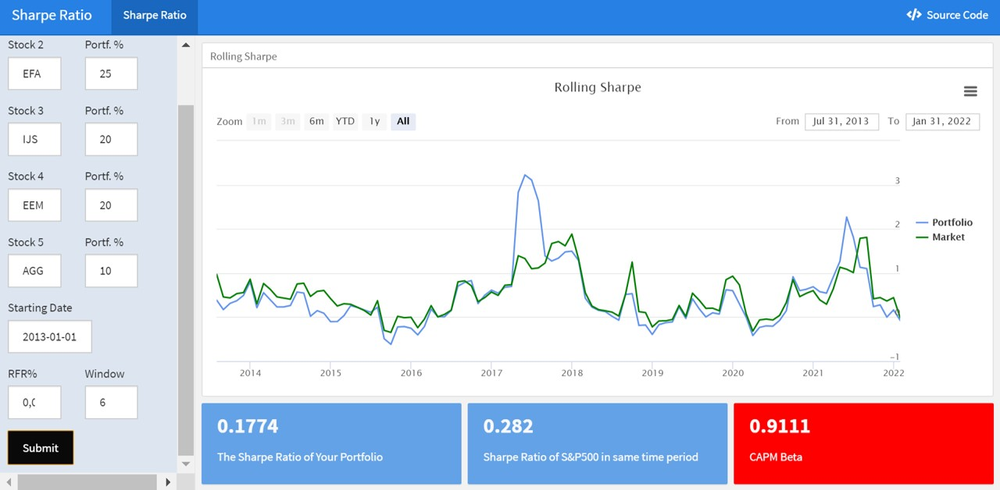

```{r setup, include = FALSE}
library(knitr)                              # paquete que trae funciones utiles para R Markdown
library(tidyverse)                          # paquete que trae varios paquetes comunes en el tidyverse
library(datos)                              # paquete que viene con datos populares traducidos al español :)
library(shiny)
library(icons)
# opciones predeterminadas
knitr::opts_chunk$set(echo = FALSE,         # FALSE: los bloques de código NO se muestran
                      dpi = 300,            # asegura gráficos de alta resolución
                      warning = FALSE,      # los mensajes de advertencia NO se muestran
                      error = FALSE)        # los mensajes de error NO se muestran


options(htmltools.dir.version = FALSE)


library(tidyverse)
library(lubridate)
library(readxl)
library(highcharter)
library(tidyquant)
library(timetk)
library(tibbletime)
library(quantmod)
library(PerformanceAnalytics)
library(scales)


library(tidyverse)
library(lubridate)
library(readxl)
library(highcharter)
library(tidyquant)
library(timetk)
library(tibbletime)
library(quantmod)
library(PerformanceAnalytics)
library(scales)


symbols <- c("SPY","EFA", "IJS", "EEM","AGG")


prices <-
  getSymbols(symbols,
             src = 'yahoo',
             from = "2012-12-31",
             to = "2017-12-31",
             auto.assign = TRUE,
             warnings = FALSE) %>%
  map(~Ad(get(.))) %>%
  reduce(merge) %>%
  `colnames<-`(symbols)


prices_monthly <- to.monthly(prices,
                             indexAt = "lastof",
                             OHLC = FALSE)
head(prices_monthly, 7)


asset_returns_xts <-
  Return.calculate(prices_monthly,
                   method = "log") %>%
  na.omit()
head(round(asset_returns_xts,3), 7)


hc_hist <- hist(asset_returns_xts[, symbols[1]],
                breaks = 50,
                plot = FALSE)

hchart(hc_hist, color = "cornflowerblue") %>%
  hc_title(text =
             paste(symbols[1],
                   "Log Returns Distribution",
                   sep = " ")) %>%
  hc_add_theme(hc_theme_flat()) %>%
  hc_exporting(enabled = TRUE) %>%
  hc_legend(enabled = FALSE)


asset_returns_dplyr_byhand <- prices %>%
  to.monthly(indexAt = "lastof", OHLC = FALSE) %>%
  # convert the index to a date
  data.frame(date = index(.)) %>%
  # now remove the index because it got converted to row names
  remove_rownames() %>%
  gather(asset, prices, -date) %>%
  group_by(asset) %>%
  mutate(returns = (log(prices) - log(lag(prices)))) %>%
  select(-prices) %>%
  spread(asset, returns) %>%
  select(date, symbols)


asset_returns_dplyr_byhand <-
  asset_returns_dplyr_byhand %>%
  na.omit()


asset_returns_long <-
  asset_returns_dplyr_byhand %>%
  gather(asset, returns, -date) %>%
  group_by(asset)


asset_returns_long %>%
  ggplot(aes(x = date, y = returns, color=asset)) +
  geom_line()+
  ggtitle("Monthly Returns Since 2013") +
  xlab("Date") +
  ylab("Returns") +
  theme_update(plot.title = element_text(hjust = 0.5))


w <- c(0.25, 0.25, 0.20, 0.20, 0.10)
tibble(w, symbols)

w_1 <- w[1]
w_2 <- w[2]
w_3 <- w[3]
w_4 <- w[4]
w_5 <- w[5]
asset1 <- asset_returns_xts[,1]
asset2 <- asset_returns_xts[,2]
asset3 <- asset_returns_xts[,3]
asset4 <- asset_returns_xts[,4]
asset5 <- asset_returns_xts[,5]
portfolio_returns_byhand <-
  (w_1 * asset1) +
  (w_2 * asset2) +
  (w_3 * asset3) +
  (w_4 * asset4) +
  (w_5 * asset5)
names(portfolio_returns_byhand) <- "returns"


portfolio_returns_tq_rebalanced_monthly <-
  asset_returns_long %>%
  tq_portfolio(assets_col = asset,
               returns_col = returns,
               weights = w,
               col_rename = "returns",
               rebalance_on = "months")


portfolio_returns_xts_rebalanced_monthly <-
Return.portfolio(asset_returns_xts,
weights = w,
rebalance_on = "months") %>%
`colnames<-`("returns")


portfolio_returns_dplyr_byhand <-
asset_returns_long %>%
group_by(asset) %>%
mutate(weights = case_when(asset == symbols[1] ~ w[1],
asset == symbols[2] ~ w[2],
asset == symbols[3] ~ w[3],
asset == symbols[4] ~ w[4],
asset == symbols[5] ~ w[5]),
weighted_returns = returns * weights) %>%
group_by(date) %>%
summarise(returns = sum(weighted_returns))


```

class: left, bottom
background-image: url("img/back1.jpg")
background-size: cover


# **`r rmarkdown::metadata$title`**
----

## **`r rmarkdown::metadata$institute`**

### `r rmarkdown::metadata$author`
### `r rmarkdown::metadata$date`

```{r xaringanExtra-share-again, echo=FALSE}
xaringanExtra::use_share_again()
```

```{r xaringanExtra-clipboard, echo=FALSE}
xaringanExtra::use_clipboard()
```

---
name: hola
class: inverse, middle, center
background-color: #E31D1D


# Universidad del Valle

--

## Maestría en Análitica e Inteligencia de Negocios
---


.pull-left[

<br><br>

.center[


[PhD. Diego F. Manotas-Duque](http://industrial.univalle.edu.co/profesores/diego-fernando-manotas-duque) <br>
Universidad del Valle
]

<br>

.center[

*PhD. in Engineering with emphasis in Electrical Engineering*

*MSc. in Management - Finance Emphasis*

*Finance Specialist*

*Industrial Engineer*

`r icon::fa("link", animate = "spin")` [Personal Webpage](http://industrial.univalle.edu.co/profesores/diego-fernando-manotas-duque)

]

]


.pull-right[


<br><br>

.center[


[PhD. Student. Orlando Joaqui-Barandica](https://www.joaquibarandica.com) <br/>
Universidad del Valle
]

<br>


.center[

*PhD. Student in Engineering with emphasis in Engineering Industrial* 
 
*MSc. Applied Economics*
 
*BSc. Statistic*

<br>

`r icon::fa("link", animate = "spin")` [www.joaquibarandica.com](https://www.joaquibarandica.com)

]


]


---

class: center, middle


### [https://gifinc.univalle.edu.co/](https://gifinc.univalle.edu.co/)


---

name: menu
background-image: url("img/back2.jpg")
background-size: cover
class: left, middle


# Contenido

----


.pull-left[
### `r icon("upload")` [Sharpe Ratio](#sr)
* xts
* tidyverse


### `r icon("broom")` [CAPM](#capm)


]


.pull-right[

### `r icon("cubes")` [App Shiny](#shiny)


]

---

name: sr
class: inverse, center, middle
background-color: #00081d

# `r icon("upload")`
# Sharpe Ratio
----

.right[
.bottom[
####  [`r icon("bell")`](#menu)
]
]

---

# `r icon("upload")` Packages


Los siguientes son los paquetes que serán utilizados en los temas del curso.


----

.scroll-box-20[
```{r eval=FALSE, echo=TRUE, message=FALSE, warning=FALSE , fig.height = 4}


# Recuerde cargar las librerías

library(tidyverse)
library(lubridate)
library(readxl)
library(highcharter)
library(tidyquant)
library(timetk)
library(tibbletime)
library(quantmod)
library(PerformanceAnalytics)
library(scales)
library(plotly)

```
]

----


---

# `r icon("upload")` Sharpe Ratio


.pull-left[


El ratio de Sharpe es una medida para analizar el rendimiento de una inversión, teniendo en cuenta el riesgo que suponga esa inversión.

<br>

`En finanzas, cuanto más arriesgada sea una inversión, la rentabilidad que se espera de ella es mayor, dado que esperamos que se pague más por arriesgar más. Con el ratio de Sharpe podemos comparar carteras con riesgos diferentes y saber cuál ha tenido más éxito, ya que estamos ajustando el riesgo. Este ratio financiero nos dice lo buena que es una inversión. Gracias al ajuste por riesgo podemos ver qué inversión ha obtenido más rentabilidad de su riesgo, o dicho de otra manera, cuanta rentabilidad adicional ha conseguido por invertir en activos financieros más arriesgados.`


]


.pull-right[


### Definición:

.center[El Ratio de Sharpe se define como la media de los rendimientos mensuales en exceso de la cartera por encima de la **tasa libre de riesgo**, dividido por la desviación estándar de los rendimientos mensuales en exceso de la cartera por encima de la tasa libre de riesgo. Esta es la formulación de la Razón de Sharpe a partir de 1994; si quisiéramos usar la formulación original de 1966, el denominador sería la desviación estándar de todos los rendimientos mensuales de la cartera.]


$$Sharpe Ratio = \frac{R_p - R_f}{\sigma_{exceso}}$$
**Cuanto mayor sea el ratio sharpe de una inversión, mejor será el rendimiento ajustado al riesgo de la inversión**

]


---


# `r icon("upload")` Sharpe Ratio


.pull-left[


* Si una inversión presenta más riesgo que otra, como es lógico, los inversores también exigirán una mayor rentabilidad en compensación.


]


.pull-right[


### Ahora bien, ¿cómo calculamos que la rentabilidad obtenida se ajusta bien al riesgo asumido? Para ello se parte del concepto de “prima de riesgo”.


La prima de riesgo es la rentabilidad extra que obtenemos para compensar el riesgo asumido. Pero para ello, debemos tomar como referencia un activo que se encuentre, o que sea considerado por la comunidad financiera, como “libre de riesgo”.


* La rentabilidad que nos ofrece este activo considerado como “libre de riesgo” es la denominada “tasa libre de riesgo”. Sobre esta tasa se calcula la “prima de riesgo”.


]


---


# `r icon("upload")` Sharpe Ratio

.pull-left[

### Qué es la tasa libre de riesgo?


Una tasa libre de riesgo es aquella rentabilidad obtenida por invertir en un activo que está considerado como libre de riesgo.

* En principio es una `valoración teórica`. Se supone que todas las inversiones tienen un componente de riesgo.


*Sin embargo, si invertimos en un activo que no cambie su rentabilidad durante toda su vida o duración (activo de renta fija) que tenga una mínima fluctuación de mercado, y por último, que sea de un emisor de reconocida solvencia (para que sea remota la probabilidad de que incumpla su promesa de pago), tenemos un activo que podríamos considerar como “libre de riesgo”.*


]


.pull-right[


**¿Dónde encontramos estos activos?**


Como norma general se utiliza el interés que pagan por los Bonos del Estado, puesto que estos activos cumplen perfectamente las condiciones anteriormente descritas.

.center[
### **En Colombia,** se pueden usar las tasas de los bonos de tesoro o incluso de los TES. En refinitiv pueden encontrarlos como: GOVERNMENT BOND PRICES, aparece para varios plazos.
]


]


---


# `r icon("upload")` Sharpe Ratio

.center[
```{r out.width= "90%"}
knitr::include_graphics("img/Tasas.JPG")
```
]


---


# `r icon("upload")` Sharpe Ratio `xts`


.pull-left[


* Para cualquier trabajo con el Ratio de Sharpe, primero debemos elegir una tasa libre de riesgo (en adelante RFR) y usaremos .3%.


```

rfr <- .0003


```

Calcular la razón de Sharpe en el mundo `xts` es muy sencillo a partir de la función `SharpeRatio()` de la librería `PerfomanceAnalytics`


]


.pull-right[


```{r eval=TRUE, echo=TRUE, message=FALSE, warning=FALSE , fig.height = 4}

rfr <- .0003

sharpe_xts <-
SharpeRatio(portfolio_returns_xts_rebalanced_monthly,
            Rf = rfr,
            FUN = "StdDev") %>%
`colnames<-`("sharpe_xts")


sharpe_xts

```


]


---


# `r icon("upload")` Sharpe Ratio `tidyverse`


.pull-left[


* Para nuestro ejemplo de tidyverse, implementaremos la ecuación de la relación de Sharpe a través de pipes y dplyr.

Empezamos con nuestro objeto `portfolio_returns_dplyr_byhand` y luego ejecutamos:


```

summarise(ratio = mean(returns - rfr)/sd(returns - rfr))


```

que se asigna a la ecuación de la relación de Sharpe.


]


.pull-right[


```{r eval=TRUE, echo=TRUE, message=FALSE, warning=FALSE , fig.height = 4}

rfr <- .0003

sharpe_tidyverse_byhand <-
           portfolio_returns_dplyr_byhand %>%
           summarise(sharpe_dplyr = mean(returns - rfr)/
           sd(returns - rfr))


sharpe_tidyverse_byhand

```


]


---


# `r icon("upload")` Sharpe Ratio

### Sharpe Ratio vs S&P500

.pull-left[


* A continuación, comparamos con el Sharpe Ratio del S&P500 en el mismo período de tiempo.


----
.scroll-box-14[
```{r eval =FALSE, echo=TRUE, message=FALSE, warning=FALSE , fig.height = 6 }


market_returns_xts <-
          getSymbols("SPY",
          src = 'yahoo',
          from = "2012-12-31",
          to = "2017-12-31",
          auto.assign = TRUE,
          warnings = FALSE) %>%
          map(~Ad(get(.))) %>%
          reduce(merge) %>%
          `colnames<-`("SPY") %>%
          to.monthly(indexAt = "lastof",
          OHLC = FALSE)


market_sharpe <-
          market_returns_xts %>%
          tk_tbl(preserve_index = TRUE,
          rename_index = "date") %>%
          mutate(returns =
          (log(SPY) - log(lag(SPY)))) %>%
          na.omit() %>%
          summarise(ratio =
          mean(returns - rfr)/sd(returns - rfr))


market_sharpe$ratio
  
```
]
----

]

.pull-right[


```
[1] 0.4348  

```

.center[
### Nuestra cartera ha tenido un rendimiento inferior al del mercado durante el período de tiempo elegido.
]


----

]

---

# `r icon("upload")` Sharpe Ratio

### Recuerde: 

.right[En definitiva, es una herramienta para calcular mejor la relación rentabilidad/riesgo. Esto significa que no sirve solo con que un activo sea muy rentable, como pueden serlo las criptomonedas, sino en función de cuánto lo es con respecto al riesgo asumido.


<br>
<br>

Así, se pueden dar paradojas como que una acción tradicional que lleve cotizando más de 30 años en el mercado tiene mejor calificación en el ratio de Sharpe que una compañía growth que lleve creciendo a dos dígitos durante los últimos años.

]


---


# `r icon("upload")` Sharpe Ratio


.pull-left[


* Antes de visualizar el Sharpe real, tendremos una idea de qué proporción de los rendimientos de nuestra cartera excedieron el RFR.

* Ahora, haremos dos adiciones para ayudar en nuestra visualización de datos.


* Agregaremos una columna para rendimientos que estén por debajo de la tasa libre de riesgo y agregaremos una columna para rendimientos por encima de la tasa libre de riesgo.

* Esto no es necesario para calcular la razón de Sharpe, pero veremos cómo ilustra el beneficio de hacer las cosas a mano con dplyr: si queremos extraer o crear ciertas transformaciones de datos, podemos agregarlo al flujo de código canalizado.


]


.pull-right[


```{r eval=TRUE, echo=TRUE, message=FALSE, warning=FALSE , fig.height = 4}

sharpe_byhand_with_return_columns <-
          portfolio_returns_tq_rebalanced_monthly %>%
          mutate(ratio =
          mean(returns - rfr)/sd(returns - rfr)) %>%
          mutate(returns_below_rfr =
          if_else(returns < rfr, returns, as.numeric(NA))) %>%
          mutate(returns_above_rfr =
          if_else(returns > rfr, returns, as.numeric(NA))) %>%
          mutate_if(is.numeric, funs(round(.,4)))
          sharpe_byhand_with_return_columns %>%

            
head(6)

```


]


---


# `r icon("upload")` Sharpe Ratio `(Visualization)`


.pull-left[


----
.scroll-box-12[
```{r eval =FALSE, echo=TRUE, message=FALSE, warning=FALSE , fig.height = 6 }

sharpe_byhand_with_return_columns %>%
ggplot(aes(x = date)) +
geom_point(aes(y = returns_below_rfr),
colour = "red") +
geom_point(aes(y = returns_above_rfr),
colour = "green") +
geom_vline(xintercept =
as.numeric(as.Date("2016-11-30")),
color = "blue") +
geom_hline(yintercept = rfr,
color = "purple",
linetype = "dotted") +
annotate(geom = "text",
x = as.Date("2016-11-30"),
y = -.04,
label = "Election",
fontface = "plain",
angle = 90,
alpha = .5,
vjust = 1.5) +
  ylab("percent monthly returns") +
scale_y_continuous(breaks = pretty_breaks(n = 10)) +
scale_x_date(breaks = pretty_breaks( n = 8))
  
```
]
----

> Note que después de las elecciones presidenciales de Noviembre en Estados Unidos hay cero rendimientos por debajo de la RFR (Rate free risk)


]

.pull-right[


```{r eval =TRUE, echo=FALSE, message=FALSE, warning=FALSE , fig.height = 6 }

sharpe_byhand_with_return_columns %>%
ggplot(aes(x = date)) +
geom_point(aes(y = returns_below_rfr),
colour = "red") +
geom_point(aes(y = returns_above_rfr),
colour = "green") +
geom_vline(xintercept =
as.numeric(as.Date("2016-11-30")),
color = "blue") +
geom_hline(yintercept = rfr,
color = "purple",
linetype = "dotted") +
annotate(geom = "text",
x = as.Date("2016-11-30"),
y = -.04,
label = "Election",
fontface = "plain",
angle = 90,
alpha = .5,
vjust = 1.5) +
  ylab("percent monthly returns") +
scale_y_continuous(breaks = pretty_breaks(n = 10)) +
scale_x_date(breaks = pretty_breaks( n = 8))
  

```


]

---


# `r icon("upload")` Sharpe Ratio `(Visualization)`


.pull-left[


----
.scroll-box-12[
```{r eval =FALSE, echo=TRUE, message=FALSE, warning=FALSE , fig.height = 6 }

sharpe_byhand_with_return_columns %>%
ggplot(aes(x = returns)) +
geom_histogram(alpha = 0.45,
binwidth = .01,
fill = "cornflowerblue") +
geom_vline(xintercept = rfr,
color = "green") +
annotate(geom = "text",
x = rfr,
y = 13,
label = "rfr",
fontface = "plain",
angle = 90,
alpha = .5,
vjust = 1)
  
```
]
----


]

.pull-right[


```{r eval =TRUE, echo=FALSE, message=FALSE, warning=FALSE , fig.height = 6 }

sharpe_byhand_with_return_columns %>%
ggplot(aes(x = returns)) +
geom_histogram(alpha = 0.45,
binwidth = .01,
fill = "cornflowerblue") +
geom_vline(xintercept = rfr,
color = "green") +
annotate(geom = "text",
x = rfr,
y = 13,
label = "rfr",
fontface = "plain",
angle = 90,
alpha = .5,
vjust = 1)
  

```


]

---


# `r icon("upload")` Sharpe Ratio `(Visualization)`


.pull-left[


----
.scroll-box-12[
```{r eval =FALSE, echo=TRUE, message=FALSE, warning=FALSE , fig.height = 6 }

portfolio_sd_xts_builtin <-
           StdDev(asset_returns_xts, weights = w)

portfolio_sd_xts_builtin_percent <-
           round(portfolio_sd_xts_builtin * 100, 2)

sharpe_tq <-
portfolio_returns_tq_rebalanced_monthly %>%
tq_performance(Ra = returns,
performance_fun = SharpeRatio,
Rf = rfr,
FUN = "StdDev") %>%
`colnames<-`("sharpe_tq")


asset_returns_long %>%
summarise(stand_dev = sd(returns),
sharpe = mean(returns - rfr)/
sd(returns - rfr))%>%
add_row(asset = "Portfolio",
stand_dev =
portfolio_sd_xts_builtin[1],
sharpe =
sharpe_tq$sharpe_tq) %>%
ggplot(aes(x = stand_dev,
y = sharpe,
color = asset)) +
geom_point(size = 2) +
geom_text(
aes(x =
sd(portfolio_returns_tq_rebalanced_monthly$returns),
y =
sharpe_tq$sharpe_tq + .02,
label = "Portfolio")) +
ylab("Sharpe Ratio") +
xlab("standard deviation") +
ggtitle("Sharpe Ratio versus Standard Deviation") +
# The next line centers the title
theme_update(plot.title = element_text(hjust = 0.5))
  
```
]
----

> Indica que el S&P500 nuevamente parece dominar nuestra cartera, aunque tiene un poco más de riesgo.

Eso es interesante de observar pero, al igual que con la desviación estándar, la asimetría y la curtosis, estos números generales pueden ocultar importantes períodos de fluctuación en nuestros datos. Podemos resolver eso trabajando con la relación de Sharpe móvil.


]

.pull-right[


```{r eval =TRUE, echo=FALSE, message=FALSE, warning=FALSE , fig.height = 6 }

portfolio_sd_xts_builtin <-
           StdDev(asset_returns_xts, weights = w)

portfolio_sd_xts_builtin_percent <-
           round(portfolio_sd_xts_builtin * 100, 2)

sharpe_tq <-
portfolio_returns_tq_rebalanced_monthly %>%
tq_performance(Ra = returns,
performance_fun = SharpeRatio,
Rf = rfr,
FUN = "StdDev") %>%
`colnames<-`("sharpe_tq")

asset_returns_long %>%
summarise(stand_dev = sd(returns),
sharpe = mean(returns - rfr)/
sd(returns - rfr))%>%
add_row(asset = "Portfolio",
stand_dev =
portfolio_sd_xts_builtin[1],
sharpe =
sharpe_tq$sharpe_tq) %>%
ggplot(aes(x = stand_dev,
y = sharpe,
color = asset)) +
geom_point(size = 2) +
geom_text(
aes(x =
sd(portfolio_returns_tq_rebalanced_monthly$returns),
y =
sharpe_tq$sharpe_tq + .02,
label = "Portfolio")) +
ylab("Sharpe Ratio") +
xlab("standard deviation") +
ggtitle("Sharpe Ratio versus Standard Deviation") +
# The next line centers the title
theme_update(plot.title = element_text(hjust = 0.5))
  

```


]

---


# `r icon("upload")` Sharpe Ratio `(Visualization)`


.pull-left[


----
.scroll-box-12[
```{r eval =FALSE, echo=TRUE, message=FALSE, warning=FALSE , fig.height = 6 }

portfolio_sd_xts_builtin <-
           StdDev(asset_returns_xts, weights = w)

portfolio_sd_xts_builtin_percent <-
           round(portfolio_sd_xts_builtin * 100, 2)

sharpe_tq <-
   portfolio_returns_tq_rebalanced_monthly %>%
   tq_performance(Ra = returns,
   performance_fun = SharpeRatio,
   Rf = rfr,
   FUN = "StdDev") %>%
   `colnames<-`("sharpe_tq")

asset_returns_long %>%
   summarise(stand_dev = sd(returns),
   sharpe = mean(returns - rfr)/
   sd(returns - rfr))%>%
   add_row(asset = "Portfolio",
   stand_dev =
   portfolio_sd_xts_builtin[1],
   sharpe =
   sharpe_tq$sharpe_tq) %>%
   ggplot(aes(x = stand_dev,
   y = sharpe,
   color = asset)) +
   geom_point(size = 2) +
   geom_text(
   aes(x =
   sd(portfolio_returns_tq_rebalanced_monthly$returns),
   y =
   sharpe_tq$sharpe_tq + .02,
   label = "Portfolio")) +
   ylab("Sharpe Ratio") +
   xlab("standard deviation") +
   ggtitle("Sharpe Ratio versus Standard Deviation") +
   theme_update(plot.title = element_text(hjust = 0.5))
  
```
]
----

> Indica que el S&P500 nuevamente parece dominar nuestra cartera, aunque tiene un poco más de riesgo.

Eso es interesante de observar pero, al igual que con la desviación estándar, la asimetría y la curtosis, estos números generales pueden ocultar importantes períodos de fluctuación en nuestros datos. Podemos resolver eso trabajando con la relación de Sharpe móvil.


]

.pull-right[


```{r eval =TRUE, echo=FALSE, message=FALSE, warning=FALSE , fig.height = 6 }

portfolio_sd_xts_builtin <-
           StdDev(asset_returns_xts, weights = w)

portfolio_sd_xts_builtin_percent <-
           round(portfolio_sd_xts_builtin * 100, 2)

sharpe_tq <-
portfolio_returns_tq_rebalanced_monthly %>%
tq_performance(Ra = returns,
performance_fun = SharpeRatio,
Rf = rfr,
FUN = "StdDev") %>%
`colnames<-`("sharpe_tq")

asset_returns_long %>%
summarise(stand_dev = sd(returns),
sharpe = mean(returns - rfr)/
sd(returns - rfr))%>%
add_row(asset = "Portfolio",
stand_dev =
portfolio_sd_xts_builtin[1],
sharpe =
sharpe_tq$sharpe_tq) %>%
ggplot(aes(x = stand_dev,
y = sharpe,
color = asset)) +
geom_point(size = 2) +
geom_text(
aes(x =
sd(portfolio_returns_tq_rebalanced_monthly$returns),
y =
sharpe_tq$sharpe_tq + .02,
label = "Portfolio")) +
ylab("Sharpe Ratio") +
xlab("standard deviation") +
ggtitle("Sharpe Ratio versus Standard Deviation") +
#The next line centers the title
theme_update(plot.title = element_text(hjust = 0.5))
  

```


]

---


# `r icon("upload")` Rolling Sharpe Ratio `(xts)`


.pull-left[


----
.scroll-box-16[
```{r eval =FALSE, echo=TRUE, message=FALSE, warning=FALSE , fig.height = 6 }

window <- 24

rolling_sharpe_xts <-
      rollapply(portfolio_returns_xts_rebalanced_monthly,
      window,
      function(x)
      SharpeRatio(x,
      Rf = rfr,
      FUN = "StdDev")) %>%
      na.omit() %>%
      `colnames <-` ("xts")

highchart(type = "stock") %>%
       hc_title(text = "Rolling 24-Month Sharpe") %>%
       hc_add_series(rolling_sharpe_xts,
       name = "sharpe",
       color = "blue") %>%
       hc_navigator(enabled = FALSE) %>%
       hc_scrollbar(enabled = FALSE) %>%
       hc_add_theme(hc_theme_flat()) %>%
       hc_exporting(enabled = TRUE)
  
```
]
----


]

.pull-right[


```{r eval =TRUE, echo=FALSE, message=FALSE, warning=FALSE , fig.height = 6 }

window <- 24

rolling_sharpe_xts <-
      rollapply(portfolio_returns_xts_rebalanced_monthly,
      window,
      function(x)
      SharpeRatio(x,
      Rf = rfr,
      FUN = "StdDev")) %>%
      na.omit() %>%
      `colnames<-`("xts")

highchart(type = "stock") %>%
       hc_title(text = "Rolling 24-Month Sharpe") %>%
       hc_add_series(rolling_sharpe_xts,
       name = "sharpe",
       color = "blue") %>%
       hc_navigator(enabled = FALSE) %>%
       hc_scrollbar(enabled = FALSE) %>%
       hc_add_theme(hc_theme_flat()) %>%
       hc_exporting(enabled = TRUE)
  

```


]

---


# `r icon("upload")` Rolling Sharpe Ratio `(tidyverse)`


.pull-left[


----

.scroll-box-16[
```{r eval =FALSE, echo=TRUE, message=FALSE, warning=FALSE , fig.height = 6 }

rolling_sharpe_xts %>%
tk_tbl(preserve_index = TRUE,
rename_index = "date") %>%
rename(rolling_sharpe = xts) %>%
ggplot(aes(x = date,
y = rolling_sharpe)) +
geom_line(color = "cornflowerblue") +
ggtitle("Rolling 24-Month Sharpe Ratio") +
labs(y = "rolling sharpe ratio") +
  scale_x_date(breaks = pretty_breaks(n = 8)) +
theme(plot.title = element_text(hjust = 0.5))
  
```
]

----


]

.pull-right[


```{r eval =TRUE, echo=FALSE, message=FALSE, warning=FALSE , fig.height = 6 }

rolling_sharpe_xts %>%
tk_tbl(preserve_index = TRUE,
rename_index = "date") %>%
rename(rolling_sharpe = xts) %>%
ggplot(aes(x = date,
y = rolling_sharpe)) +
geom_line(color = "cornflowerblue") +
ggtitle("Rolling 24-Month Sharpe Ratio") +
labs(y = "rolling sharpe ratio") +
  scale_x_date(breaks = pretty_breaks(n = 8)) +
theme(plot.title = element_text(hjust = 0.5))
  

```


]

---


name: capm
class: inverse, center, middle
background-color: #00081d

# `r icon("upload")`
# CAPM Beta
----

.right[
.bottom[
####  [`r icon("bell")`](#menu)
]
]

---


# `r icon("upload")` CAPM Beta


.pull-left[


A modo de antecedentes extraordinariamente breves, el Modelo de fijación de precios de activos de capital (CAPM - Capital Asset Pricing Model) es un modelo, creado por William Sharpe, que estima el rendimiento de un activo en función del rendimiento del mercado y la relación lineal del activo con el rendimiento del mercado. Esa relación lineal es el coeficiente beta de la acción.


> $\beta$ se puede considerar como la sensibilidad de la acción al mercado, o su riesgo con respecto al mercado.


$$ER_i = R_f + \beta_i (ER_m - R_f)$$
dónde

* $ER_i$ Retorno esperado de la inversión
* $R_f$ Risk free rate
* $\beta_i$ Beta de la inversión
* $(ER_m - R_f)$ Prima de riesgo de mercado

]

.pull-right[

Nos centraremos en un aspecto particular de CAPM: $\beta$. 

<br>

> $\beta$, como señalamos anteriormente, es el coeficiente de un activo que resulta de la regresión de los rendimientos de ese activo sobre los rendimientos del mercado. Captura la relación lineal entre el activo y el mercado. Para nuestros propósitos, es un buen vehículo para explorar un flujo reproducible para modelar o hacer una regresión de los rendimientos de nuestra cartera sobre los rendimientos del mercado. Incluso si su equipo prefiere modelos con más matices, este flujo de trabajo puede servir como una buena base.


]

---


# `r icon("upload")` CAPM Beta


.pull-left[


El indicador Beta relaciona la volatilidad de un activo, del mercado, y la correlación de activo y mercado. Es decir, en términos estadísticos relaciona la covarianza del activo con el mercado, con la varianza del mercado.


$$\beta_{Portafolio} = \frac{cov(R_p, R_m)}{\sigma_m} $$


La interpretación es sencilla. 

<br>

* Si $\beta$ de un activo es **mayor que 1**, éste tiene mayor riesgo sistémico que el mercado, y amplifica los movimientos de éste. El activo sería más volátil. Por ejemplo, en un periodo de pérdidas o depreciación, el activo tendría más pérdidas que el conjunto del mercado. Al revés cuando sea un periodo alcista.

]

.pull-right[

* Si sucede lo contrario, y $\beta$ es **menor que 1**, quiere decir que el activo tiene menor riesgo sistémico que el mercado, es menos volátil que la tendencia general.

<br>

* Por último, si el valor **es negativo**, quiere decir que la relación es inversa. Es decir, que la rentabilidad del activo aumentará cuando caiga la del mercado y viceversa.

]

---


# `r icon("upload")` CAPM Beta `xts`


.pull-left[


Nuestro primer paso es elegir qué activo usar como indicador del **rendimiento del mercado**, por ahora trabajaremos con el SPY ETF, tratando efectivamente al S&P500 como el mercado.

Eso hace que nuestros cálculos sean sustancialmente poco interesantes porque 

* (1) SPY es el 25 % de nuestra cartera
* (2) hemos elegido activos y un período de tiempo (2013 - 2017) en los que las correlaciones con SPY han sido altas.


> Con esas advertencias en mente, siéntase libre de elegir un activo diferente para el rendimiento del mercado e intente reproducir este trabajo, o construya una cartera diferente que no incluya SPY.


]


.pull-right[

.scroll-box-16[
```{r eval =TRUE, echo=TRUE, message=FALSE, warning=FALSE , fig.height = 6 }


market_returns_xts <-
      getSymbols("SPY",
      src = 'yahoo',
      from = "2012-12-31",
      to = "2017-12-31",
      auto.assign = TRUE,
      warnings = FALSE) %>%
      map(~Ad(get(.))) %>%
      reduce(merge) %>%
      `colnames<-`("SPY") %>%
      to.monthly(indexAt = "lastof",
      OHLC = FALSE) %>%
      Return.calculate(.,
      method = "log") %>%
      na.omit()


head(market_returns_xts,5)

```
]

> Es importante destacar que si tu portafolio por ejemplo presenta inversiones en el mercado de activos tecnológicos, puedes buscar un activo enfocado en el rendimineto del mercado tecnológico para hacer la comparación.


]

---


# `r icon("upload")` CAPM Beta `tidyverse`


.pull-left[


Nuestro primer paso es elegir qué activo usar como indicador del **rendimiento del mercado**, por ahora trabajaremos con el SPY ETF, tratando efectivamente al S&P500 como el mercado.

Eso hace que nuestros cálculos sean sustancialmente poco interesantes porque 

* (1) SPY es el 25 % de nuestra cartera
* (2) hemos elegido activos y un período de tiempo (2013 - 2017) en los que las correlaciones con SPY han sido altas.


> Con esas advertencias en mente, siéntase libre de elegir un activo diferente para el rendimiento del mercado e intente reproducir este trabajo, o construya una cartera diferente que no incluya SPY.


]


.pull-right[

.scroll-box-16[
```{r eval =TRUE, echo=TRUE, message=FALSE, warning=FALSE , fig.height = 6 }


market_returns_tidy <-
        market_returns_xts %>%
        tk_tbl(preserve_index = TRUE,
        rename_index = "date") %>%
        na.omit() %>%
        select(date, returns = SPY)


head(market_returns_tidy, 5)

```
]

> Es importante destacar que si tu portafolio por ejemplo presenta inversiones en el mercado de activos tecnológicos, puedes buscar un activo enfocado en el rendimineto del mercado tecnológico para hacer la comparación.


]


---


# `r icon("upload")` CAPM Beta


```{r eval =TRUE, echo=TRUE, message=FALSE, warning=FALSE , fig.height = 6 }


portfolio_returns_tq_rebalanced_monthly %>%
         mutate(market_returns = market_returns_tidy$returns) %>%
         head(20)

```


---


# `r icon("upload")` CAPM Beta `xts`


.pull-left[


* La covarianza de los rendimientos de la cartera y los rendimientos del mercado dividida por la varianza de los rendimientos del mercado es igual a la estimación beta ponderada de cada activo.


$$\beta_{Portfolio} = \sum_{i=1}^n W_i \beta_i$$
* $\beta$ está cerca de 1 y no es una sorpresa ya que SPY es una gran parte de esta cartera.

* Además, al ser menor que 1 esta cartera tiene menor riesgo sistémico que el mercado. Esto es natural, ya que nuestra cartera está más diversificada respecto al mercado.

]


.pull-right[


```{r eval =TRUE, echo=TRUE, message=FALSE, warning=FALSE , fig.height = 6 }


beta_builtin_xts <-
    CAPM.beta(portfolio_returns_xts_rebalanced_monthly,
    market_returns_xts)
    beta_builtin_xts


    
```


]

---


name: shiny
class: inverse, center, middle
background-color: #00081d

# `r icon("broom")`
# Shiny App
----

.right[
.bottom[
####  [`r icon("bell")`](#menu)
]
]


---

# `r icon("broom")` Shiny App

.center[
```{r out.width= "100%"}

```
]


---


# `r icon("broom")` Shiny App


.scroll-box-18[
````
---
title: "Sharpe Ratio"
runtime: shiny
output:
  flexdashboard::flex_dashboard:
    orientation: rows
    source_code: embed
---

```{r setup, message = FALSE}`r ''`
library(flexdashboard)
library(highcharter)
library(tidyquant)
library(timetk)
library(shiny)
library(scales)
library(purrr)
```

Sidebar {.sidebar}
=====================================
  
```{r}`r ''`

fluidRow(
  column(5,
  textInput("stock1", "Stock 1", "SPY")),
  column(5,
  numericInput("w1", "Portf. %", 25, min = 1, max = 100))
)  

fluidRow(
  column(5,
  textInput("stock2", "Stock 2", "EFA")),
  column(5,
  numericInput("w2", "Portf. %", 25, min = 1, max = 100))
)

fluidRow(
  column(5,
  textInput("stock3", "Stock 3", "IJS")),
  column(5,
  numericInput("w3", "Portf. %", 20, min = 1, max = 100))
)

fluidRow(
  column(5,
  textInput("stock4", "Stock 4", "EEM")),
  column(5,
  numericInput("w4", "Portf. %", 20, min = 1, max = 100))
)

fluidRow(
  column(5,
  textInput("stock5", "Stock 5", "AGG")),
  column(5,
  numericInput("w5", "Portf. %", 10, min = 1, max = 100))
)


fluidRow(
  column(7,
  dateInput("date", "Starting Date", "2013-01-01", format = "yyyy-mm-dd")))

fluidRow(
  column(5,
  numericInput("rfr", "RFR%", .03, min = 0, max = 1, step = .0002)),
  column(5,
  numericInput("window", "Window", 6, min = 3, max = 24, step = 2))
)

actionButton("go", "Submit")
```

```{r}`r ''`
# market calculations

rfr <- eventReactive(input$go, {input$rfr/100})

window <- eventReactive(input$go, {input$window}) 


market_returns <- eventReactive(input$go, {
  
    getSymbols("SPY", src = 'yahoo', 
            from = input$date, 
             auto.assign = TRUE, 
             warnings = FALSE) %>% 
    map(~Ad(get(.))) %>% 
    reduce(merge) %>%
    `colnames<-`("SPY") %>% 
    to.monthly(indexAt = "lastof", 
               OHLC = FALSE) %>% 
    Return.calculate(method = "log") %>% 
    na.omit()  
})

market_sharpe <- eventReactive(input$go, {
  
  SharpeRatio(market_returns(),
              Rf = rfr(), 
              FUN = "StdDev")
})

market_rolling_sharpe <- eventReactive(input$go, {
  
  rollapply(market_returns(), 
            window(), 
            function(x) 
            SharpeRatio(x, 
                        Rf = rfr(), 
                        FUN = "StdDev")) %>% 
  na.omit()
})
```

```{r}`r ''`
# Portfolio calculations

portfolio_returns <- eventReactive(input$go, {
  
  symbols <- c(input$stock1, input$stock2, input$stock3, input$stock4, input$stock5)
  
  validate(need(input$w1 + input$w2 + input$w3 + input$w4 + input$w5 == 100, 
                "The portfolio weights must sum to 100%!"))
  
  w <- c(input$w1/100, input$w2/100, input$w3/100, input$w4/100, input$w5/100)
  
  getSymbols(symbols, src = 'yahoo', from = input$date, 
             auto.assign = TRUE, warnings = FALSE) %>% 
  map(~Ad(get(.))) %>% 
  reduce(merge) %>%
  `colnames<-`(symbols) %>% 
  to.monthly(indexAt = "lastof", 
             OHLC = FALSE) %>% 
  Return.calculate(method = "log") %>% 
  na.omit() %>% 
  Return.portfolio(weights = w)
  
})


portfolio_rolling_sharpe <- eventReactive(input$go, {

  rollapply(portfolio_returns(),
            window(),
            function(x) SharpeRatio(x, 
                                    Rf = rfr(), 
                                    FUN = "StdDev")) %>% 
  na.omit()
})

portfolio_sharpe <- eventReactive(input$go, {
  
  validate(need(input$w1 + input$w2 + input$w3 + input$w4 + input$w5 == 100, "------"))
  
  SharpeRatio(portfolio_returns(),
              Rf = rfr(), 
              FUN = "StdDev")
  
})


beta_builtin_xts <- eventReactive(input$go, {
    CAPM.beta(portfolio_returns(), market_returns())


})

```

Sharpe Ratio
=====================================  

Row {data-height=800}
-----------------------------------------------------------------------

### Rolling Sharpe

```{r}`r ''`
renderHighchart({
  
  validate(need(input$go, "Please choose your portfolio assets, weights, rfr, rolling window and start date and click submit."))
  
  
  highchart(type = "stock") %>%
  hc_title(text = "Rolling Sharpe") %>%
  hc_add_series(portfolio_rolling_sharpe(), name = "Portfolio", color = "cornflowerblue") %>%
  hc_add_series(market_rolling_sharpe(), name = "Market", color = "green") %>%
  hc_navigator(enabled = FALSE) %>% 
  hc_scrollbar(enabled = FALSE) %>% 
  hc_exporting(enabled = TRUE) %>% 
  hc_legend(enabled = TRUE, align = "right", verticalAlign = "middle",
            layout = "vertical")

  
})
```


Row {data-height=200}
-----------------------------------------------------------------------

### The Sharpe Ratio of Your Portfolio

```{r}`r ''`
renderValueBox({
  
  
  valueBox(value = tags$p(round(portfolio_sharpe(), 4), 
                          style = "font-size: 70%;"), 
           color = "primary")
})

```

### Sharpe Ratio of S&P500 in same time period

```{r}`r ''`
renderValueBox({
  
  valueBox(value = tags$p(round(market_sharpe(), 4), 
                          style = "font-size: 70%;"), 
           color = "primary")
})

```


### CAPM Beta

```{r}`r ''`
renderValueBox({
  
  valueBox(value = tags$p(round(beta_builtin_xts(), 4), 
                          style = "font-size: 70%;"), 
           color = "red")
})

```
````
]


---


class: inverse, center, middle
background-color: #00081d


.pull-left[

.center[
<br><br>

# Thanks!!!

<br><br><br><br><br>


### Questions?
]


]


.pull-right[


.center[


`r anicon::faa("envelope", animate = "passing")` diego.manotas@correounivalle.edu.co


<br><br><br>


.center[


`r anicon::faa("envelope", animate = "passing")` orlando.joaqui@correounivalle.edu.co 
]


]


]


<br><br><br>

----

*The images used to set the presentation are from [pixabay](https://pixabay.com/).*


