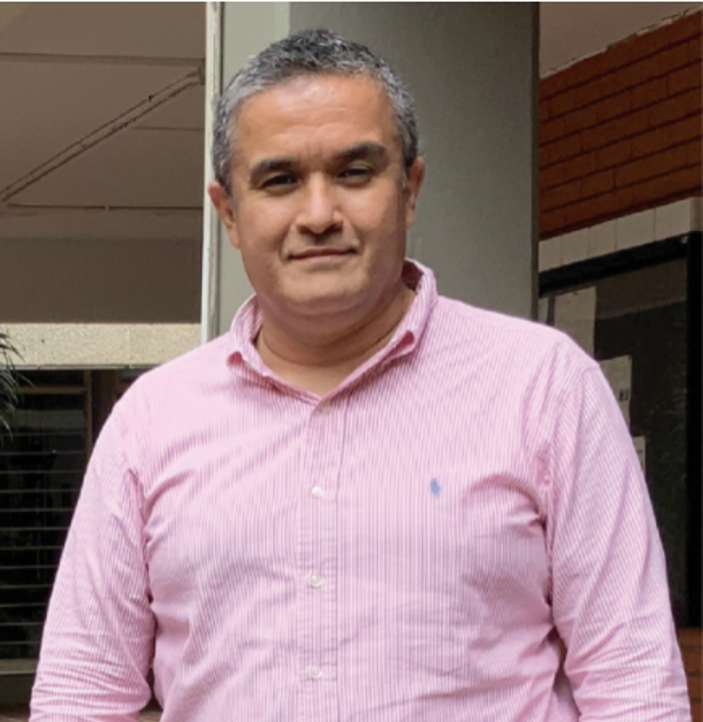
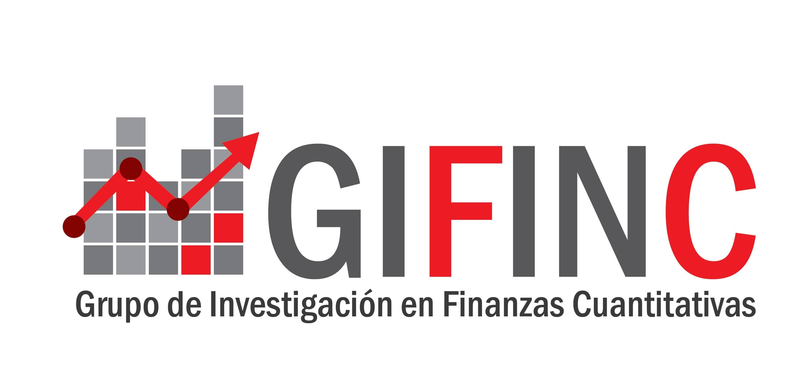

```{r setup, include = FALSE}
library(knitr)                              # paquete que trae funciones utiles para R Markdown
library(tidyverse)                          # paquete que trae varios paquetes comunes en el tidyverse
library(datos)                              # paquete que viene con datos populares traducidos al español :)
library(shiny)
library(icons)
# opciones predeterminadas
knitr::opts_chunk$set(echo = FALSE,         # FALSE: los bloques de código NO se muestran
                      dpi = 300,            # asegura gráficos de alta resolución
                      warning = FALSE,      # los mensajes de advertencia NO se muestran
                      error = FALSE)        # los mensajes de error NO se muestran


options(htmltools.dir.version = FALSE)
```

class: inverse, left, bottom
background-image: url("img/back1.jpg")
background-size: cover


# **`r rmarkdown::metadata$title`**
----

## **`r rmarkdown::metadata$institute`**

### `r rmarkdown::metadata$author`
### `r rmarkdown::metadata$date`

```{r xaringanExtra-share-again, echo=FALSE}
xaringanExtra::use_share_again()
```

```{r xaringanExtra-clipboard, echo=FALSE}
xaringanExtra::use_clipboard()
```

---
name: hola
class: inverse, middle, center
background-color: #E31D1D


# Universidad del Valle

--

## Maestría en Análitica e Inteligencia de Negocios
---


.pull-left[

<br><br>

.center[


[PhD. Diego F. Manotas-Duque](http://industrial.univalle.edu.co/profesores/diego-fernando-manotas-duque) <br>
Universidad del Valle
]

<br>

.center[

*PhD. in Engineering with emphasis in Electrical Engineering*

*MSc. in Management - Finance Emphasis*

*Finance Specialist*

*Industrial Engineer*

`r icon::fa("link", animate = "spin")` [Personal Webpage](http://industrial.univalle.edu.co/profesores/diego-fernando-manotas-duque)

]

]


.pull-right[


<br><br>

.center[


[PhD. Student. Orlando Joaqui-Barandica](https://www.joaquibarandica.com) <br/>
Universidad del Valle
]

<br>


.center[

*PhD. Student in Engineering with emphasis in Engineering Industrial* 
 
*MSc. Applied Economics*
 
*BSc. Statistic*

<br>

`r icon::fa("link", animate = "spin")` [www.joaquibarandica.com](https://www.joaquibarandica.com)

]


]


---

class: center, middle



### [https://gifinc.univalle.edu.co/](https://gifinc.univalle.edu.co/)


---

name: menu
background-color: #F5B041
class: left, middle, inverse

# Contenido

----


.pull-left[
### `r icon("chevron-circle-right")` [Activity 1.](#one)

]


.pull-right[


]

---


name: one
class: inverse, center


# Actividad 1.
----

<br>
<br>
<br>

.pull-left[

###Financial institutions always try to bet on those businesses that generate the highest possible profitability according to the capital invested and the risk assumed.


----

Ratios such as ROA facilitate decision-making and at the same time provide more precise information on the profitability they generate, taking into account elements such as the risk they assume or the capital they invest.


]


.pull-right[


###To relate the profitability of an entity to its assets, the most widely used ratio is ROA ('Return on Assets'), which relates its performance to the total assets of the entity in question.

<br>

$$ROA= \frac{ \text{Net income}}{ \text{Total assets}} $$

]


???

Las entidades financieras siempre intentan apostar por aquellos negocios que generen la mayor rentabilidad posible según el capital invertido y el riesgo asumido.

Ratios como el ROA facilitan la toma de decisiones y al mismo tiempo brindan información más precisa sobre la rentabilidad que generan, teniendo en cuenta elementos como el riesgo que asumen o el capital que invierten.

Para relacionar la rentabilidad de una entidad con sus activos, la razón más utilizada es el ROA ('Retorno de los Activos'), que relaciona su desempeño con los activos totales de la entidad en cuestión.


---

class: inverse


# Actividad 1.
----

.left-column[


]

.right-column[

1️⃣ Descargue desde Refinitiv Eikon información de todas las entidades financieras para todas las regiones. Que incluya las siguientes variables:

* Identifier (RIC)
* Company Name
* Country of Exchange
* TRBC Industry Group Name
* "Return on Assets - Actual" (Últimos 80 trimestres)


2️⃣ Limpie la base en Excel (Recomendado) de posibles celdas combinadas, encabezados, etc.


3️⃣ Importe la Base en R y Convierta la base a formato **Long**

4️⃣ Seleccione las variables: Company Name, TRBC Industry Group Name y ROA

5️⃣ Identifique posibles inconsistencias de la base que no le permitan llevarla a formato **wide** en dónde por cada columna tenga una entidad financiera y por filas los trimestres.

6️⃣ Convierta la base a formato **wide**


]

---


class: inverse, center, middle


# Actividad 1.
----


### Reto


Intente generar lo anterior en una función que le permita seleccionar el país, además intente generar el vector de fecha y que sea la columna inicial de la base **wide**


---


class: inverse, center, middle
background-color: #00081d


.pull-left[

.center[
<br><br>

# Thanks!!!

<br><br><br><br><br>


### Questions?
]


]


.pull-right[


.center[


`r anicon::faa("envelope", animate = "passing")` diego.manotas@correounivalle.edu.co


<br><br><br>


.center[


`r anicon::faa("envelope", animate = "passing")` orlando.joaqui@correounivalle.edu.co 
]


]


]


<br><br><br>

----

*The images used to set the presentation are from [pixabay](https://pixabay.com/).*


